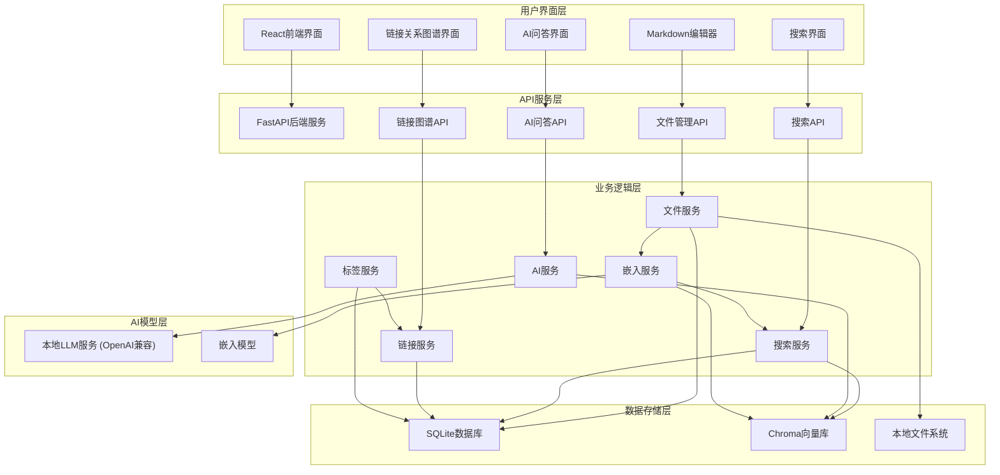
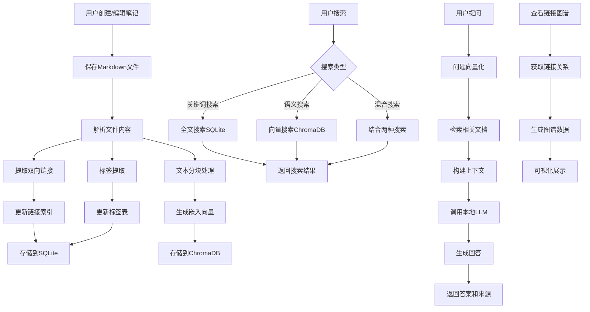
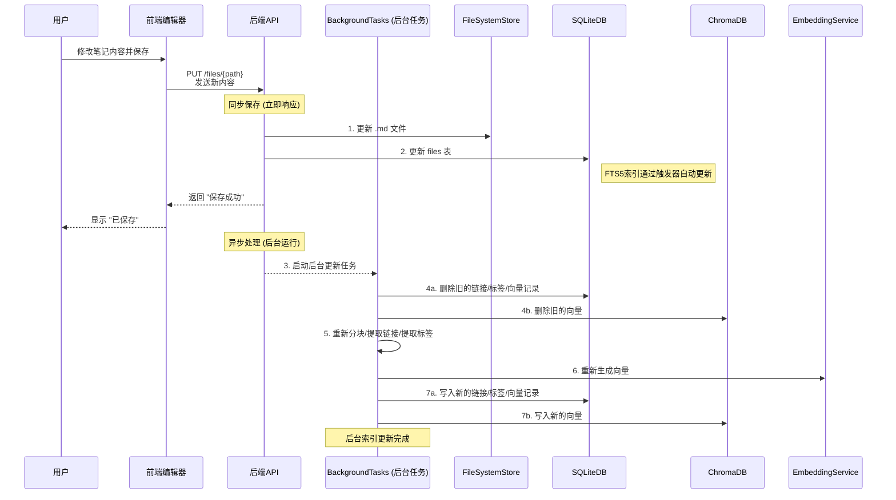
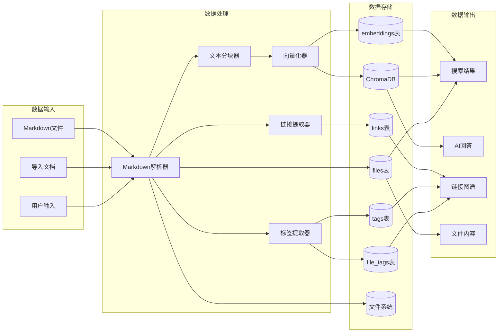
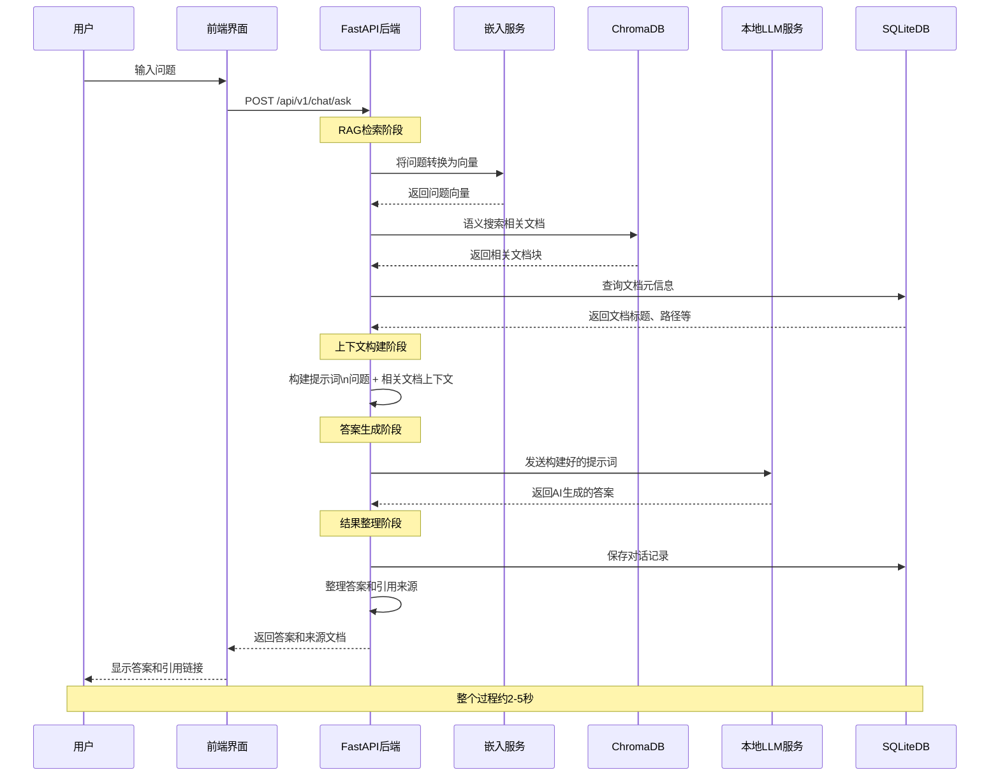

# AI笔记本项目

## 项目简介

AI笔记本是一个**纯本地、AI增强的个人知识管理系统**，旨在为用户提供安全、私密且智能的笔记管理体验。

### 核心特性

- 🔒 **纯本地运行**：所有数据存储在本地，确保隐私安全
- 📝 **Markdown格式**：使用标准Markdown格式，数据可移植性强
- 🤖 **AI智能问答**：基于本地LLM的RAG问答系统
- 🐳 **容器化部署**：一键启动，简化安装和运行
- 🕸️ **链接可视化**：双向链接网络图谱和关系展示
- 🔗 **双向链接**：支持笔记间的双向链接和关系可视化
- 🔍 **混合搜索**：结合关键词搜索和语义搜索
- 📁 **智能文件管理**：文件树状视图，支持拖拽移动、右键菜单操作
- ✨ **自动保存**：实时自动保存编辑内容，支持Ctrl+S快捷键

### 最新功能更新

#### 文件树选中状态功能
- **文件夹选中状态**：点击文件夹时会显示选中状态，便于识别当前工作目录
- **当前目录显示**：在文件树顶部显示当前选中的目录路径
- **智能新建**：新建文件/文件夹时会在当前选中的目录下创建
- **视觉反馈**：选中的文件/文件夹有明显的蓝色背景标识
- **目录指示**：创建对话框中会明确显示将在哪个目录下创建新项目

#### 编辑器增强功能
- **自动保存**：每1秒自动保存编辑内容
- **Ctrl+S快捷键**：支持传统的保存快捷键
- **保存状态指示**：实时显示保存状态（已保存/保存中/未保存）

#### 文件操作优化
- **拖拽移动**：支持文件和文件夹的拖拽移动
- **右键菜单**：提供新建、重命名、删除等快捷操作
- **自动展开**：操作完成后自动展开相关目录

### 技术架构

- **前端**：React + TypeScript + Ant Design
- **后端**：FastAPI + Python
- **数据库**：SQLite + ChromaDB
- **AI**：LangChain (通过OpenAI兼容接口连接本地AI模型服务)
- **部署**：Docker + Docker Compose

## 系统架构图

### 整体架构流程图


### 核心业务流程图


### 笔记更新工作流程

当用户修改并保存一篇笔记时，系统会触发一系列同步和异步操作来保证数据一致性。



### 数据流转图


### AI问答系统(RAG)流程图


### 开发阶段流程图

```mermaid
gantt
    title AI笔记本项目开发时间线
    dateFormat  X
    axisFormat %s

    section 阶段一：基础架构
    项目结构设计        :done, arch1, 0, 1w
    开发环境配置        :done, arch2, after arch1, 1w
    容器化基础设施      :active, arch3, after arch2, 1w
    基础API设计         :arch4, after arch3, 1w

    section 阶段二：核心功能
    Markdown编辑器      :editor, after arch4, 2w
    文件管理系统        :files, after arch4, 2w
    双向链接功能        :links, after editor, 1w
    基础搜索功能        :search, after files, 1w

    section 阶段三：AI功能
    本地LLM集成         :llm, after links, 2w
    嵌入模型集成        :embed, after search, 2w
    RAG问答系统         :rag, after llm, 2w
    向量搜索优化        :vector, after embed, 1w

    section 阶段四：高级功能
    链接关系可视化      :graph, after rag, 2w
    智能推荐系统        :advsearch, after vector, 2w
    数据导入导出        :import, after graph, 1w
    插件系统设计        :plugin, after advsearch, 1w

    section 阶段五：优化部署
    性能优化            :perf, after import, 1w
    用户体验优化        :ux, after plugin, 1w
    测试完善            :test, after perf, 1w
    文档编写            :docs, after ux, 1w
```


## 如何使用流程图指导开发

### 📋 架构理解
- **整体架构流程图**：了解系统各层次的关系和数据流向
- **核心业务流程图**：理解四大核心功能的处理流程
- **数据流转图**：掌握数据从输入到输出的完整生命周期

### 🔄 开发指导
- **AI问答系统流程图**：实现RAG问答功能的详细步骤
- **开发阶段流程图**：按时间线推进各阶段开发任务

### 💡 开发建议
1. **先看架构图**：理解整体设计后再开始编码
2. **按流程实现**：严格按照业务流程图实现各功能模块
3. **数据优先**：根据数据流转图设计数据模型和API
4. **阶段推进**：按开发阶段流程图的时间线执行
5. **测试验证**：每个流程节点都要有对应的测试用例

## 项目结构

```
ai-notebook/
├── frontend/                 # 前端React应用
├── backend/                  # 后端FastAPI应用
├── docker/                   # Docker配置文件
├── docs/                     # 项目文档
├── tests/                    # 测试文件
├── scripts/                  # 构建和部署脚本
├── docker-compose.yml        # 服务编排
├── README.md                 # 项目说明
├── DATABASE.md               # 数据库结构文档
└── requirements.txt          # 依赖管理
```

## 快速开始

### 环境要求

- Docker 和 Docker Compose
- 至少 16GB 内存
- 至少 100GB 存储空间

### 安装运行

```bash
# 克隆项目
git clone <repository-url>
cd ai-notebook

# 启动服务
docker-compose up -d

# 访问应用
# 前端：http://localhost:3000
# API文档：http://localhost:8000/docs
```

## 开发指南

### 开发环境设置

```bash
# 前端开发
cd frontend
npm install
npm run dev

# 后端开发
cd backend
pip install -r requirements.txt
uvicorn main:app --reload
```

### 代码规范

- 前端：ESLint + Prettier
- 后端：Black + isort
- 提交：Conventional Commits

## 函数列表

### 前端组件

#### 编辑器相关
- `MarkdownEditor` - Markdown编辑器组件
  - 参数：`content: string, onChange: (content: string) => void`
  - 返回：React组件
  - 文件：`frontend/src/components/Editor/MarkdownEditor.tsx`
  - 功能：提供Markdown编辑和实时预览功能

- `FileTree` - 文件树组件
  - 参数：`files: FileNode[], onSelect: (file: FileNode) => void`
  - 返回：React组件
  - 文件：`frontend/src/components/FileTree/FileTree.tsx`
  - 功能：显示文件夹结构和文件列表

#### 搜索相关
- `SearchBar` - 搜索栏组件
  - 参数：`onSearch: (query: string) => void, placeholder?: string`
  - 返回：React组件
  - 文件：`frontend/src/components/Search/SearchBar.tsx`
  - 功能：提供搜索输入和搜索建议

- `SearchResults` - 搜索结果组件
  - 参数：`results: SearchResult[], onSelect: (result: SearchResult) => void`
  - 返回：React组件
  - 文件：`frontend/src/components/Search/SearchResults.tsx`
  - 功能：显示搜索结果列表

#### AI问答相关
- `ChatInterface` - 聊天界面组件
  - 参数：`messages: Message[], onSendMessage: (message: string) => void`
  - 返回：React组件
  - 文件：`frontend/src/components/Chat/ChatInterface.tsx`
  - 功能：AI问答聊天界面

- `LinkGraph` - 链接关系图谱组件
  - 参数：`nodes: LinkNode[], edges: LinkEdge[]`
  - 返回：React组件
  - 文件：`frontend/src/components/Graph/LinkGraph.tsx`
  - 功能：可视化笔记间的链接关系

### 后端API

#### 文件管理 (backend/app/api/files.py)
- `create_file_api()` - 创建文件
  - 参数：`file: FileCreate`
  - 返回：`FileResponse`
  - 功能：创建新文件（同时写入数据库和磁盘）

- `read_file_api()` - 根据ID读取文件
  - 参数：`file_id: int`
  - 返回：`FileResponse`
  - 功能：根据文件ID读取文件信息

- `read_file_by_path_api()` - 根据路径读取文件
  - 参数：`file_path: str`
  - 返回：`FileResponse`
  - 功能：根据文件路径读取文件（支持从磁盘自动导入）

- `read_files_api()` - 获取文件列表
  - 参数：`skip: int, limit: int, include_deleted: bool`
  - 返回：`List[FileResponse]`
  - 功能：分页获取文件列表

- `update_file_api()` - 更新文件
  - 参数：`file_id: int, file: FileUpdate`
  - 返回：`FileResponse`
  - 功能：更新文件内容（同时更新数据库和磁盘）

- `delete_file_api()` - 删除文件
  - 参数：`file_id: int`
  - 返回：`None`
  - 功能：软删除文件

- `get_file_tree_api()` - 获取文件树
  - 参数：`root_path: str`
  - 返回：`List[Dict]`
  - 功能：获取目录树结构

- `create_directory_api()` - 创建目录
  - 参数：`request: dict`
  - 返回：`Dict`
  - 功能：创建新目录

- `search_files_api()` - 搜索文件
  - 参数：`q: str, search_type: str, limit: int`
  - 返回：`List[FileResponse]`
  - 功能：全文搜索文件内容

#### 搜索功能
- `search_files()` - 文件搜索
  - 参数：`query: str, search_type: SearchType`
  - 返回：`List[SearchResult]`
  - 文件：`backend/app/api/search.py`
  - 功能：结合SQLite FTS5的关键词搜索和ChromaDB的语义搜索，实现混合搜索。

- `semantic_search()` - 语义搜索
  - 参数：`query: str, top_k: int = 10`
  - 返回：`List[SemanticResult]`
  - 文件：`backend/app/services/chromadb_service.py`
  - 功能：基于ChromaDB的向量相似度搜索

#### AI功能 (backend/app/api/ai.py)
- `generate_summary_api()` - 生成内容摘要
  - 参数：`request: SummaryRequest`
  - 返回：`Dict[str, str]`
  - 功能：使用AI生成文档摘要

- `suggest_tags_api()` - 智能标签建议
  - 参数：`request: TagSuggestionRequest`
  - 返回：`Dict[str, List[str]]`
  - 功能：基于内容智能推荐标签

- `create_embeddings_api()` - 创建向量嵌入
  - 参数：`file_id: int`
  - 返回：`Dict[str, Any]`
  - 功能：为指定文件创建向量嵌入

- `semantic_search_api()` - 语义搜索
  - 参数：`request: SemanticSearchRequest`
  - 返回：`Dict[str, List]`
  - 功能：基于语义相似度搜索文档

- `analyze_content_api()` - 内容分析
  - 参数：`request: ContentAnalysisRequest`
  - 返回：`Dict[str, Any]`
  - 功能：分析文档内容特征

- `generate_related_questions_api()` - 生成相关问题
  - 参数：`request: RelatedQuestionsRequest`
  - 返回：`Dict[str, List[str]]`
  - 功能：基于内容生成相关思考问题

- `get_ai_status_api()` - 获取AI服务状态
  - 参数：无
  - 返回：`Dict[str, Any]`
  - 功能：检查AI服务可用性和配置状态

#### 链接关系
- `build_link_graph()` - 构建链接关系图
  - 参数：`file_ids: List[int]`
  - 返回：`LinkGraph`
  - 文件：`backend/app/services/link_service.py`
  - 功能：基于双向链接构建关系图谱

- `get_link_data()` - 获取链接关系数据
  - 参数：`file_id?: int, depth: int = 2`
  - 返回：`LinkGraphData`
  - 文件：`backend/app/api/links.py`
  - 功能：获取笔记的链接关系数据

### 工具函数

#### 文本处理
- `chunk_text()` - 文本分块
  - 参数：`text: str, chunk_size: int = 1000, overlap: int = 200`
  - 返回：`List[TextChunk]`
  - 文件：`backend/app/utils/text_utils.py`
  - 功能：将长文本分割成较小的块

- `parse_markdown()` - Markdown解析
  - 参数：`content: str`
  - 返回：`ParsedMarkdown`
  - 文件：`backend/app/utils/markdown_utils.py`
  - 功能：解析Markdown内容，提取标题、链接等

#### 数据库操作
- `init_database()` - 初始化数据库
  - 参数：无
  - 返回：`bool`
  - 文件：`backend/app/database/init.py`
  - 功能：创建数据库表和索引

- `get_db_session()` - 获取数据库会话
  - 参数：无
  - 返回：`Session`
  - 文件：`backend/app/database/session.py`
  - 功能：获取数据库连接会话

## 变量说明

### 环境变量

#### 应用配置
- `APP_HOST` - 应用主机地址，默认：`localhost`
- `APP_PORT` - 应用端口，默认：`8000`
- `APP_DEBUG` - 调试模式，默认：`false`
- `APP_SECRET_KEY` - 应用密钥，用于加密

#### 数据库配置
- `DATABASE_URL` - 数据库连接URL，默认：`sqlite:///./data/ai_notebook.db`
- `DATA_DIRECTORY` - 数据存储根目录，默认：`./data`
- `CHROMA_DB_PATH` - ChromaDB向量数据库路径，默认：`./data/chroma_db`

#### AI模型配置
- `OPENAI_API_KEY` - OpenAI API密钥，用于AI功能
- `OPENAI_BASE_URL` - OpenAI API基础URL，支持本地或第三方兼容服务
- `OPENAI_MODEL` - 使用的模型名称，默认：`gpt-3.5-turbo`

#### 文件存储配置
- `NOTES_DIRECTORY` - 笔记文件存储目录，默认：`../notes`（相对于backend目录）
- `MAX_FILE_SIZE` - 最大文件大小，默认：`10MB`

#### 搜索配置
- `SEARCH_LIMIT` - 默认搜索结果数量，默认：`50`
- `EMBEDDING_DIMENSION` - 向量维度，默认：`1536`（OpenAI text-embedding-ada-002）

### 全局常量

#### API相关
- `API_VERSION` - API版本号，值：`v1`
- `API_PREFIX` - API前缀，值：`/api/v1`
- `CORS_ORIGINS` - 允许的跨域源，值：`["http://localhost:3000"]`

#### 搜索相关
- `DEFAULT_SEARCH_LIMIT` - 默认搜索结果数量，值：`20`
- `MAX_SEARCH_LIMIT` - 最大搜索结果数量，值：`100`
- `SEARCH_TIMEOUT` - 搜索超时时间（秒），值：`30`

#### AI相关
- `DEFAULT_TEMPERATURE` - 默认AI生成温度，值：`0.7`
- `MAX_TOKENS` - 最大生成token数，值：`2048`
- `CHUNK_SIZE` - 文本分块大小，值：`1000`
- `CHUNK_OVERLAP` - 分块重叠大小，值：`200`

## 测试

### 运行测试

```bash
# 前端测试
cd frontend
npm test

# 后端测试
cd backend
pytest

# 端到端测试
npm run test:e2e
```

### 测试覆盖率

- 单元测试覆盖率目标：> 80%
- 集成测试覆盖率目标：> 70%
- API测试覆盖率目标：> 90%

## 部署

### 生产环境部署

```bash
# 构建生产镜像
docker-compose -f docker-compose.prod.yml build

# 启动生产服务
docker-compose -f docker-compose.prod.yml up -d
```

### 性能监控

- 应用性能监控：集成APM工具
- 资源使用监控：CPU、内存、磁盘
- 日志收集：结构化日志记录

## 贡献指南

1. Fork 项目
2. 创建功能分支 (`git checkout -b feature/AmazingFeature`)
3. 提交更改 (`git commit -m 'Add some AmazingFeature'`)
4. 推送到分支 (`git push origin feature/AmazingFeature`)
5. 打开 Pull Request

## 许可证

本项目采用 MIT 许可证 - 查看 [LICENSE](LICENSE) 文件了解详情。

## 更新日志

### v0.1.0 (计划中)
- 基础架构搭建
- Markdown编辑器实现
- 文件管理系统
- 基础搜索功能

### v0.2.0 (计划中)
- AI问答功能
- 向量搜索
- 双向链接

### v0.3.0 (计划中)
- 链接关系可视化
- 智能推荐系统
- 插件系统

---

## 项目状态

- 项目概念设计：✅ 已完成
- 技术架构设计：✅ 已完成
- 开发计划制定：✅ 已完成
- 基础架构搭建：✅ 已完成
- 开发环境搭建：✅ 已完成

### 最新进展（2024年12月30日）

**阶段一：基础架构搭建 - 已完成**

- ✅ 完整项目目录结构创建
- ✅ 服务Docker容器化架构（frontend + backend）
- ✅ 前端React+TypeScript基础框架搭建
- ✅ 后端FastAPI基础框架搭建
- ✅ 开发和生产环境配置
- ✅ 启动脚本和工具链
- ✅ 项目文档和开发指南

**当前状态**: 项目基础架构已搭建完成，可以开始核心功能开发

**快速启动**: 请查看 [GETTING_STARTED.md](GETTING_STARTED.md) 了解如何启动项目

---

**注意**：本项目仍在开发中，功能和API可能会发生变化。请关注更新日志了解最新进展。 