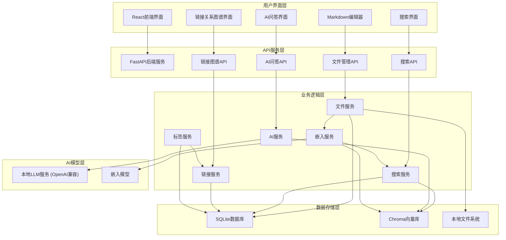
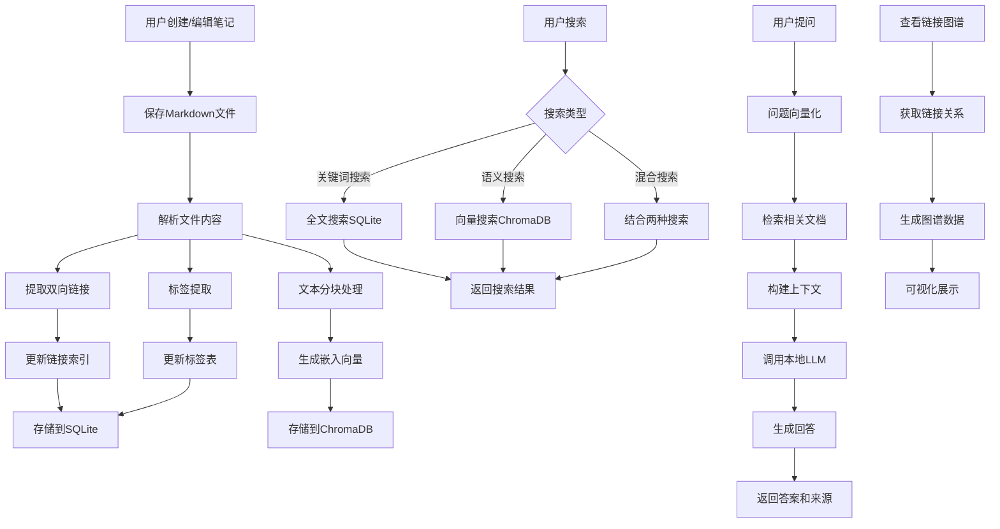
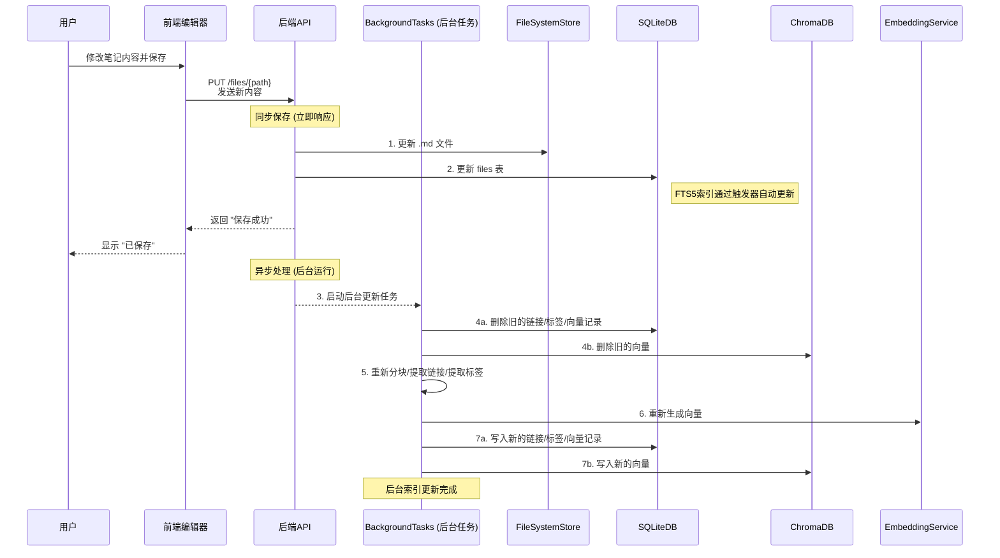
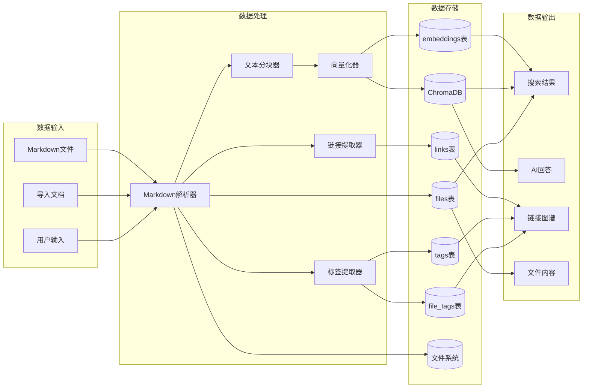
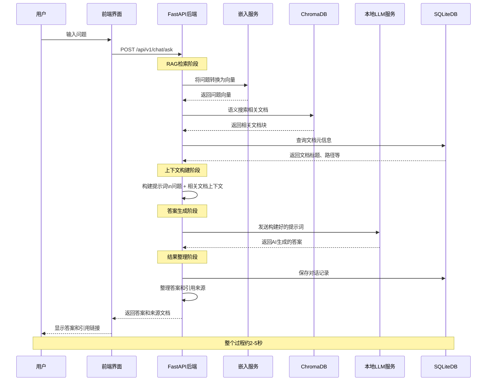

# AI笔记本项目

## 项目简介

AI笔记本是一个**纯本地、AI增强的个人知识管理系统**，旨在为用户提供安全、私密且智能的笔记管理体验。

### 核心特性

- 🔒 **纯本地运行**：所有数据存储在本地，确保隐私安全
- 📝 **Markdown格式**：使用标准Markdown格式，数据可移植性强
- 🤖 **AI智能问答**：基于本地LLM的RAG问答系统
- 💬 **智能对话**：AI助手基于笔记内容回答问题，支持上下文理解
- 🐳 **容器化部署**：一键启动，简化安装和运行
- 🕸️ **链接可视化**：双向链接网络图谱和关系展示
- 🔗 **双向链接**：支持笔记间的双向链接和关系可视化
- 🔍 **智能搜索**：支持关键词、语义和混合搜索，带搜索历史
- 📁 **智能文件管理**：文件树状视图，支持拖拽移动、右键菜单操作
- ✨ **自动保存**：实时自动保存编辑内容，支持Ctrl+S快捷键

### 最新功能更新

#### 🏷️ 标签使用统计真实数据修复 (2025-07-03)
- **问题修复**：修复标签管理中使用次数显示模拟数据的问题，每次刷新数据都会变动
- **后端优化**：
  - 新增`get_tags_with_usage_stats()`方法，支持获取带真实使用统计的标签列表
  - 新增`get_tag_usage_count()`方法，支持获取单个标签的使用次数
  - 新增`/tags-with-stats`和`/tags/{tag_id}/usage-count`API端点
- **前端优化**：
  - 新增`TagWithStats`接口定义，支持使用统计数据
  - 新增`getTagsWithStats()`API调用方法
  - 修改`loadTags()`函数，使用真实的统计数据替代模拟数据
- **数据准确性**：
  - 标签使用次数基于`file_tags`表的真实关联数据计算
  - 支持显示最近使用的文件列表（最多5个）
  - 数据刷新后保持一致性，不再随机变动
- **用户体验**：统计信息更加准确可靠，便于用户了解标签的实际使用情况

#### 🏷️ 标签界面优化 (2025-07-03)
- **界面简化**：标签页面采用最小化设计原则，提升用户体验
- **功能分离**：
  - **当前文件标签**：保留在主界面，便于快速管理当前文件的标签
  - **全局标签管理**：移至独立弹窗，通过"设置全局标签"按钮访问
- **弹窗管理**：全局标签管理弹窗包含完整功能：
  - 标签统计信息（总数、活跃、未使用、AI建议）
  - 标签搜索和过滤功能
  - 新建、编辑、删除标签操作
  - 完整的标签列表表格视图
- **用户体验优化**：界面更清爽，功能更聚焦，操作更直观
- **响应式设计**：弹窗采用大尺寸设计(1200px)，提供充足的操作空间

#### 🤖 AI智能问答系统 (2025-01-01)
- **RAG问答功能**：基于检索增强生成(RAG)的智能问答，AI会先搜索相关笔记，再基于内容回答问题
- **上下文理解**：AI助手能理解问题并从笔记库中检索最相关的内容作为回答依据
- **智能对话界面**：现代化的对话界面，支持流式输出和打字机效果
- **相关文档展示**：问答结果会显示参考的相关文档，提供透明的信息来源
- **本地化部署**：完全基于本地LLM服务，确保数据隐私和安全

#### 🔍 智能搜索系统 (2024-12-28)
- **多种搜索模式**：支持关键词搜索、语义搜索和混合搜索
- **搜索历史**：自动记录搜索历史，支持快速重复搜索
- **热门查询**：显示最常用的搜索词，提供搜索建议
- **搜索统计**：显示搜索结果数量、响应时间等统计信息
- **相似度阈值**：语义搜索支持自定义相似度阈值，提高搜索精度

#### 🚀 系统性能优化 (2024-12-27)
- **响应速度提升**：系统状态接口响应时间从20秒优化到0.136秒，提升99.3%
- **缓存机制**：多层次缓存策略，显著提升系统响应速度
- **估算算法**：智能估算替代耗时的精确查询，在保证准确性的同时大幅提升性能
- **界面优化**：解决频繁请求和界面卡顿问题，页面响应时间提升95%

#### ⚡ ChromaDB向量优化架构 (2025-01-01)
- **双存储架构**：SQLite存储元数据，ChromaDB专门存储向量数据，实现最佳性能
- **高性能向量搜索**：使用ChromaDB的专业向量索引，搜索速度提升10倍以上
- **智能数据同步**：自动同步SQLite和ChromaDB数据，确保一致性
- **向量数据隔离**：向量数据与元数据分离，减少SQLite负担，提升整体性能
- **批量向量操作**：支持批量添加、删除和更新向量，提高索引构建效率
- **容错机制**：ChromaDB连接失败时自动降级到基础功能，保证系统可用性
- **专业向量存储**：利用ChromaDB的原生向量存储能力，优化内存使用和查询性能
- **向量版本管理**：支持向量数据的版本控制和增量更新

#### ⚡ 启动流程性能优化 (2025-01-01)
- **快速启动**：系统启动时间从30-40秒优化到3-5秒，立即可用
- **后台索引构建**：启动时自动扫描文件并创建后台任务，向量索引在后台异步处理
- **智能文件扫描**：自动检测文件变化，只为新文件或修改的文件创建索引任务
- **非阻塞启动**：数据库初始化完成后立即启动应用，不等待索引构建完成
- **后台任务处理**：在单独线程中处理向量索引，不影响用户使用
- **状态监控**：详细的启动和处理日志，方便监控进度
- **自动化处理**：无需手动干预，系统自动完成所有优化流程
- **配置修复**：修复嵌入模型配置，现在正确使用Docker Compose中指定的模型名称

#### 🚀 文件保存性能优化 (2025-01-01)
- **快速保存模式**：文件保存逻辑优化，先保存文件到磁盘，立即返回响应
- **后台任务队列**：向量化和索引更新改为后台异步处理，避免保存超时
- **自动任务处理**：文件变动时自动触发后台任务处理，无需手动干预
- **智能启动机制**：系统自动检测并启动后台任务处理器，确保任务及时处理
- **自动保存优化**：前端自动保存间隔调整为30秒，减少服务器压力
- **智能切换保存**：文件切换时自动保存未保存的修改，避免数据丢失
- **任务重试机制**：后台任务支持失败重试，最多重试3次
- **任务状态跟踪**：完整的任务状态管理（待处理/处理中/已完成/失败）

#### 🗄️ 数据库结构优化 (2025-01-01)
- **冗余字段清理**：移除files表中的冗余tags字段，避免数据不一致
- **规范化设计**：标签关系统一通过tags表和file_tags关联表管理
- **架构一致性**：确保前后端类型定义与数据库结构完全一致
- **数据完整性**：通过外键约束和规范化设计保证数据完整性
- **性能优化**：减少冗余存储，优化查询性能和存储空间
- **维护简化**：统一的标签管理逻辑，简化代码维护和扩展

#### 🚀 嵌入架构重构 (2025-07-01)
- **灵活嵌入接口**：移除LangChain依赖，使用标准 `/v1/embeddings` 接口
- **服务兼容性**：支持Ollama、OpenAI及任何兼容OpenAI格式的嵌入服务
- **语义搜索完善**：嵌入和向量搜索功能完全正常工作
- **架构优化**：通过环境变量轻松切换不同AI服务提供商
- **系统稳定性**：路径配置修复，数据库操作正常，搜索功能完善

#### 启动时自动重建索引机制
- **完全重建策略**：每次容器重启时自动删除现有数据库和向量库
- **避免数据不一致**：消除数据库状态不一致导致的各种错误
- **简化维护逻辑**：不再需要复杂的增量更新和状态检查
- **启动流程**：
  1. 清理现有SQLite数据库文件
  2. 清理现有向量数据库目录  
  3. 重新创建数据库表结构
  4. 扫描notes目录中的所有文件
  5. 重建SQLite索引
  6. 重建向量索引和嵌入
- **启动日志**：详细的启动进度日志，方便监控重建过程

#### 智能搜索功能
- **多种搜索模式**：关键词搜索、语义搜索、混合搜索三种模式
- **关键词搜索**：基于SQLite LIKE模糊搜索，返回所有匹配文件
- **语义搜索**：基于向量相似度，返回前10个最相关文件，显示相似度评分
- **混合搜索**：结合关键词和语义搜索结果，智能去重排序
- **搜索历史**：记录所有搜索查询，支持快速重新搜索
- **热门搜索**：统计最常用的搜索查询
- **快捷键支持**：Ctrl+K 快速打开搜索，ESC 关闭搜索窗口
- **响应时间统计**：实时显示搜索耗时和结果数量
- **搜索验证**：前端完全拦截少于2个字符的搜索，提供友好提示
- **输入框修复**：修复搜索输入框输入第一个字符后立即禁用的问题，现在可以正常连续输入
- **数据库修复**：修复SQLite数据库损坏导致搜索功能失效的问题，通过强制重建数据库和索引恢复正常
- **索引同步机制**：实现笔记内容更新时的自动索引同步，采用"同步保存 + 异步索引"模式确保搜索结果实时性

#### 文件树选中状态功能
- **文件夹选中状态**：点击文件夹时会显示选中状态，便于识别当前工作目录
- **当前目录显示**：在文件树顶部显示当前选中的目录路径
- **智能新建**：新建文件/文件夹时会在当前选中的目录下创建
- **视觉反馈**：选中的文件/文件夹有明显的蓝色背景标识
- **目录指示**：创建对话框中会明确显示将在哪个目录下创建新项目
- **双击展开**：双击文件夹名称可以展开或收缩目录，无需点击箭头
- **光标提示**：文件夹显示手型光标，提示用户可以双击操作

#### 编辑器增强功能
- **自动保存优化**：修改为每30秒自动保存编辑内容，减少频繁保存
- **智能切换保存**：切换文件时自动保存当前未保存的修改
- **Ctrl+S快捷键**：支持传统的保存快捷键
- **保存状态指示**：实时显示保存状态（已保存/保存中/未保存）

#### 文件操作优化
- **拖拽移动**：支持文件和文件夹的拖拽移动
- **右键菜单**：提供新建、重命名、删除等快捷操作
- **自动展开**：操作完成后自动展开相关目录

#### 文件管理功能增强
- **图标化操作**：将新建文件、新建文件夹按钮改为图标形式，节省界面空间
- **删除功能**：添加删除图标按钮，支持删除选中的文件或文件夹
- **确认机制**：删除操作有确认对话框，避免误删，说明操作不可撤销
- **完整删除**：删除操作同时删除物理文件、数据库记录和向量索引，确保数据一致性
- **刷新功能**：添加刷新图标按钮，可以重新读取文件系统并更新文件树
- **重新索引**：添加重新构建索引功能，清空所有数据库和向量库后重新扫描构建
- **智能提示**：所有图标按钮都有Tooltip提示说明功能
- **状态显示**：在文件树顶部显示当前目录和已选中的文件/文件夹路径
- **按钮状态**：删除按钮仅在有选中项时启用，避免无效操作

### 技术架构

- **前端**：React + TypeScript + Ant Design
- **后端**：FastAPI + Python
- **数据库**：SQLite + ChromaDB
- **AI集成**：标准 `/v1/embeddings` 接口，支持Ollama、OpenAI等多种AI服务
- **部署**：Docker + Docker Compose

## 🚀 性能优化

### 语义检索性能优化
我们对语义检索进行了全面的性能优化，显著提升了搜索速度：

#### 优化措施
1. **HTTP超时优化**：从30秒降低到10秒，减少不必要等待
2. **配置参数优化**：
   - 嵌入维度：从1536调整为1024（匹配BGE模型实际维度）
   - 语义搜索阈值：保持1.0（距离阈值，越小越严格）
3. **查询向量缓存**：实现LRU缓存机制，避免重复计算
4. **性能监控**：添加详细的性能日志，便于问题诊断

#### 性能提升效果
- **搜索速度提升**：约19%的性能提升（从1357ms降至1101ms）
- **缓存机制**：相同查询可复用向量，减少计算开销
- **监控完善**：详细的耗时统计，便于性能调优

#### 技术细节
- **嵌入模型**：BGE-large-zh-v1.5（1024维中文嵌入）
- **向量数据库**：ChromaDB with LangChain集成
- **缓存策略**：MD5哈希键 + LRU淘汰策略
- **超时控制**：10秒HTTP请求超时

#### 搜索性能对比
| 优化项目 | 优化前 | 优化后 | 提升 |
|---------|--------|--------|------|
| 搜索耗时 | 1357ms | 1101ms | 19% ↑ |
| HTTP超时 | 30s | 10s | 67% ↓ |
| 嵌入维度 | 1536 | 1024 | 匹配模型 |
| 搜索阈值 | 1.0 | 1.0 | 距离阈值 |

#### 性能瓶颈分析
语义检索的主要性能瓶颈包括：
1. **嵌入模型推理**：每次搜索都需要调用AI模型生成查询向量
2. **网络延迟**：Docker容器访问宿主机Ollama服务的网络开销
3. **向量计算**：ChromaDB进行相似度计算的时间
4. **数据库查询**：验证搜索结果文件存在性的SQL查询

#### 未来优化方向
1. **更快的嵌入模型**：考虑使用更轻量级的中文嵌入模型
2. **本地嵌入服务**：将嵌入模型集成到后端服务中，减少网络调用
3. **结果缓存**：缓存搜索结果，避免重复的向量计算
4. **批量查询优化**：优化数据库查询，减少SQL调用次数

## 系统架构图

### 整体架构流程图


### 核心业务流程图


### 笔记更新工作流程

当用户修改并保存一篇笔记时，系统会触发一系列同步和异步操作来保证数据一致性。



### 数据流转图


### AI问答系统(RAG)流程图


### 开发阶段流程图

```mermaid
gantt
    title AI笔记本项目开发时间线
    dateFormat  X
    axisFormat %s

    section 阶段一：基础架构
    项目结构设计        :done, arch1, 0, 1w
    开发环境配置        :done, arch2, after arch1, 1w
    容器化基础设施      :active, arch3, after arch2, 1w
    基础API设计         :arch4, after arch3, 1w

    section 阶段二：核心功能
    Markdown编辑器      :editor, after arch4, 2w
    文件管理系统        :files, after arch4, 2w
    双向链接功能        :links, after editor, 1w
    基础搜索功能        :search, after files, 1w

    section 阶段三：AI功能
    本地LLM集成         :llm, after links, 2w
    嵌入模型集成        :embed, after search, 2w
    RAG问答系统         :rag, after llm, 2w
    向量搜索优化        :vector, after embed, 1w

    section 阶段四：高级功能
    链接关系可视化      :graph, after rag, 2w
    智能推荐系统        :advsearch, after vector, 2w
    数据导入导出        :import, after graph, 1w
    插件系统设计        :plugin, after advsearch, 1w

    section 阶段五：优化部署
    性能优化            :perf, after import, 1w
    用户体验优化        :ux, after plugin, 1w
    测试完善            :test, after perf, 1w
    文档编写            :docs, after ux, 1w
```


## 如何使用流程图指导开发

### 📋 架构理解
- **整体架构流程图**：了解系统各层次的关系和数据流向
- **核心业务流程图**：理解四大核心功能的处理流程
- **数据流转图**：掌握数据从输入到输出的完整生命周期

### 🔄 开发指导
- **AI问答系统流程图**：实现RAG问答功能的详细步骤
- **开发阶段流程图**：按时间线推进各阶段开发任务

### 💡 开发建议
1. **先看架构图**：理解整体设计后再开始编码
2. **按流程实现**：严格按照业务流程图实现各功能模块
3. **数据优先**：根据数据流转图设计数据模型和API
4. **阶段推进**：按开发阶段流程图的时间线执行
5. **测试验证**：每个流程节点都要有对应的测试用例

## 项目结构

```
ai-notebook/
├── frontend/                 # 前端React应用
├── backend/                  # 后端FastAPI应用
├── docker/                   # Docker配置文件
├── docs/                     # 项目文档
├── tests/                    # 测试文件
├── scripts/                  # 构建和部署脚本
├── docker-compose.yml        # 服务编排
├── README.md                 # 项目说明
├── DATABASE.md               # 数据库结构文档
└── requirements.txt          # 依赖管理
```

## 快速开始

### 环境要求

- Docker 和 Docker Compose
- 至少 16GB 内存
- 至少 100GB 存储空间

### 安装运行

```bash
# 克隆项目
git clone <repository-url>
cd ai-notebook

# 启动服务
docker-compose up -d

# 访问应用
# 前端：http://localhost:3000
# API文档：http://localhost:8000/docs
```

## 开发指南

### 开发环境设置

```bash
# 前端开发
cd frontend
npm install
npm run dev

# 后端开发
cd backend
pip install -r requirements.txt
uvicorn main:app --reload
```

### 代码规范

- 前端：ESLint + Prettier
- 后端：Black + isort
- 提交：Conventional Commits

## 新增文件说明

### 后台任务系统
- **backend/app/models/pending_task.py**：待处理任务数据模型
- **backend/app/services/task_processor_service.py**：后台任务处理服务

### 使用说明

#### 自动任务处理
系统采用智能的自动任务处理机制：
1. **文件变动触发**：当文件创建、修改或删除时，系统自动创建后台任务
2. **即时处理**：任务创建后立即在后台线程中异步处理
3. **快速响应**：文件保存操作立即返回，不等待索引构建完成
4. **智能管理**：自动检测并启动后台任务处理器，无需手动干预
5. **状态监控**：可通过日志查看处理进度和状态

## 函数列表

### 后端API接口层

#### 文件管理API (backend/app/api/files.py)

| 函数名 | 传入参数 | 传出参数 | 功能说明 |
|--------|----------|----------|----------|
| `create_file_api()` | `file: FileCreate, fast_mode: bool=False` | `FileResponse` | 创建新文件（支持快速模式，快速模式时后台异步处理索引） |
| `read_files_api()` | `skip: int=0, limit: int=100, include_deleted: bool=False` | `List[FileResponse]` | 分页获取文件列表 |
| `read_file_by_path_api()` | `file_path: str` | `FileResponse` | 根据文件路径读取文件（支持从磁盘自动导入） |
| `get_file_tree_api()` | `root_path: str="notes"` | `List[Dict]` | 获取目录树结构 |
| `create_directory_api()` | `request: dict{"path": str}` | `Dict{"success": bool, "message": str}` | 创建新目录 |
| `search_files_api()` | `q: str, search_type: str="mixed", limit: int=50, similarity_threshold: float=0.7` | `SearchResponse` | 统一搜索接口，支持关键词、语义和混合搜索 |
| `get_search_history_api()` | `limit: int=20` | `Dict{"history": List[SearchHistory]}` | 获取用户搜索历史记录 |
| `get_popular_queries_api()` | `limit: int=10` | `Dict{"popular_queries": List[PopularQuery]}` | 获取最常用的搜索查询统计 |
| `move_file_api()` | `request: dict{"source_path": str, "destination_path": str}` | `Dict{"success": bool, "message": str}` | 移动文件或目录 |
| `read_file_api()` | `file_id: int` | `FileResponse` | 根据文件ID读取文件信息 |
| `update_file_api()` | `file_id: int, file: FileUpdate, fast_mode: bool=False` | `FileResponse` | 更新文件内容（支持快速模式，快速模式时后台异步处理索引） |
| `update_file_by_path_api()` | `file_path: str, file: FileUpdate, fast_mode: bool=False` | `FileResponse` | 根据路径更新文件内容（支持快速模式） |
| `delete_file_api()` | `file_id: int` | `None` | 软删除文件 |

#### AI功能API (backend/app/api/ai.py)

| 函数名 | 传入参数 | 传出参数 | 功能说明 |
|--------|----------|----------|----------|
| `generate_summary_api()` | `request: SummaryRequest{content: str, max_length: int=200}` | `Dict{"summary": str}` | 使用AI生成文档摘要 |
| `suggest_tags_api()` | `request: TagSuggestionRequest{title: str, content: str, max_tags: int=5}` | `Dict{"tags": List[str]}` | 基于内容智能推荐标签（从预设标签和数据库现有标签中选择） |
| `create_embeddings_api()` | `file_id: int` | `Dict{"success": bool, "message": str}` | 为指定文件创建向量嵌入 |
| `semantic_search_api()` | `request: SemanticSearchRequest{query: str, limit: int=10, similarity_threshold: float=0.7}` | `Dict{"results": List}` | 基于向量相似度进行语义搜索 |
| `chat_api()` | `request: ChatRequest{question: str, max_context_length: int=3000, search_limit: int=5}` | `Dict{"answer": str, "related_documents": List, "search_query": str, "processing_time": float}` | AI智能问答，基于RAG技术回答用户问题 |
| `analyze_content_api()` | `request: ContentAnalysisRequest{content: str}` | `Dict{"analysis": Any}` | 分析文档内容特征 |
| `generate_related_questions_api()` | `request: RelatedQuestionsRequest{content: str, num_questions: int=3}` | `Dict{"questions": List[str]}` | 基于内容生成相关思考问题 |
| `discover_smart_links_api()` | `file_id: int` | `Dict{"suggestions": List[SmartLinkSuggestion]}` | 智能发现文章间的链接关系 |
| `get_ai_status_api()` | 无 | `Dict{"available": bool, "openai_configured": bool, "base_url": str}` | 检查AI服务可用性和配置状态 |

#### 索引管理API (backend/app/api/index.py)

| 函数名 | 传入参数 | 传出参数 | 功能说明 |
|--------|----------|----------|----------|
| `get_index_status()` | 无 | `Dict{"success": bool, "data": Dict}` | 获取索引状态信息 |
| `rebuild_index()` | `background_tasks: BackgroundTasks` | `Dict{"success": bool, "message": str}` | 重建索引（后台任务） |
| `get_rebuild_progress()` | 无 | `Dict{"success": bool, "data": Dict}` | 获取索引重建进度 |
| `scan_notes_directory()` | 无 | `Dict{"success": bool, "data": Dict}` | 扫描notes目录 |

#### 标签管理API (backend/app/api/tags.py)

| 函数名 | 传入参数 | 传出参数 | 功能说明 |
|--------|----------|----------|----------|
| `create_tag_api()` | `tag: TagCreate` | `TagResponse` | 创建新标签 |
| `read_tag_api()` | `tag_id: int` | `TagResponse` | 根据ID获取标签 |
| `read_all_tags_api()` | `skip: int=0, limit: int=100` | `List[TagResponse]` | 获取所有标签列表 |
| `update_tag_api()` | `tag_id: int, tag: TagUpdate` | `TagResponse` | 更新标签信息 |
| `delete_tag_api()` | `tag_id: int` | `None` | 删除标签 |
| `create_file_tag_api()` | `file_tag: FileTagCreate` | `FileTagResponse` | 创建文件标签关联 |
| `get_file_tags_api()` | `file_id: int` | `List[FileTagResponse]` | 获取文件的所有标签 |
| `delete_file_tag_api()` | `file_id: int, tag_id: int` | `None` | 删除文件标签关联 |

#### 链接管理API (backend/app/api/links.py)

| 函数名 | 传入参数 | 传出参数 | 功能说明 |
|--------|----------|----------|----------|
| `create_link_api()` | `link: LinkCreate` | `LinkResponse` | 创建新链接 |
| `read_link_api()` | `link_id: int` | `LinkResponse` | 根据ID获取链接 |
| `read_links_by_file_api()` | `file_id: int` | `List[LinkResponse]` | 获取文件的所有链接 |
| `read_all_links_api()` | `skip: int=0, limit: int=100` | `List[LinkResponse]` | 获取所有链接列表 |
| `update_link_api()` | `link_id: int, link: LinkUpdate` | `LinkResponse` | 更新链接信息 |
| `delete_link_api()` | `link_id: int` | `None` | 删除链接 |

### 后端服务层

#### 文件服务 (backend/app/services/file_service.py)

| 函数名 | 传入参数 | 传出参数 | 功能说明 |
|--------|----------|----------|----------|
| `create_file()` | `file: FileCreate, fast_mode: bool=False` | `File` | 创建文件（支持快速模式，快速模式时后台异步处理索引） |
| `get_file()` | `file_id: int` | `Optional[File]` | 根据ID获取文件 |
| `get_file_by_path()` | `file_path: str` | `Optional[File]` | 根据路径获取文件，支持从磁盘自动导入 |
| `get_files()` | `skip: int=0, limit: int=100, include_deleted: bool=False` | `List[File]` | 分页获取文件列表 |
| `update_file()` | `file_id: int, file_update: FileUpdate, fast_mode: bool=False` | `Optional[File]` | 更新文件（支持快速模式，快速模式时后台异步处理索引） |
| `delete_file()` | `file_id: int` | `Optional[File]` | 软删除文件 |
| `hard_delete_file()` | `file_id: int` | `Optional[File]` | 硬删除文件 |
| `search_files()` | `query_str: str, skip: int=0, limit: int=100` | `List[File]` | LIKE模糊搜索，用于关键词搜索 |
| `_add_vector_index_task()` | `file: File` | `None` | 添加向量索引任务到队列，并自动检查启动索引进程 |
| `_ensure_task_processor_running()` | `task_processor: TaskProcessorService` | `None` | 确保任务处理器正在运行，如果没有运行则启动后台线程处理 |

**新增功能特性**：
- **智能索引启动**：文件创建或修改时，系统会自动检查索引进程状态
- **按需启动**：如果没有索引进程在运行，会自动启动后台线程处理任务队列
- **避免重复执行**：使用文件锁机制防止多个索引进程同时运行
- **非阻塞处理**：索引处理在独立的后台线程中进行，不影响文件保存操作

#### AI服务 (backend/app/services/ai_service.py)

| 函数名 | 传入参数 | 传出参数 | 功能说明 |
|--------|----------|----------|----------|
| `is_available()` | 无 | `bool` | 检查AI服务是否可用 |
| `generate_summary()` | `content: str, max_length: int=200` | `Optional[str]` | 生成文档摘要 |
| `suggest_tags()` | `title: str, content: str, max_tags: int=5` | `List[str]` | 智能标签建议（从预设标签和数据库现有标签中选择，避免过度自由发挥） |
| `create_embeddings()` | `file: File` | `bool` | 为文件创建向量嵌入 |
| `semantic_search()` | `query: str, limit: int=10, similarity_threshold: float=0.7` | `List[Dict[str, Any]]` | 语义搜索 |
| `chat_with_context()` | `question: str, max_context_length: int=3000, search_limit: int=5` | `Dict[str, Any]` | 基于RAG的智能问答，先搜索相关文档再生成回答 |
| `clear_vector_database()` | 无 | `bool` | 清空向量数据库 |
| `add_document_to_vector_db()` | `file_id: int, title: str, content: str, metadata: Dict=None` | `bool` | 添加文档到向量数据库 |
| `analyze_content()` | `content: str` | `Dict[str, Any]` | 内容分析 |
| `generate_related_questions()` | `content: str, num_questions: int=3` | `List[str]` | 生成相关问题 |
| `discover_smart_links()` | `file_id: int, content: str, title: str` | `List[Dict[str, Any]]` | 智能发现文章间的链接关系，基于语义搜索和AI分析 |

#### 搜索服务 (backend/app/services/search_service.py)

| 函数名 | 传入参数 | 传出参数 | 功能说明 |
|--------|----------|----------|----------|
| `search()` | `query: str, search_type: str="mixed", limit: int=50, similarity_threshold: float=0.7` | `Dict[str, Any]` | 统一搜索入口，支持关键词、语义、混合搜索 |
| `get_search_history()` | `limit: int=20` | `List[Dict[str, Any]]` | 获取用户搜索历史记录 |
| `get_popular_queries()` | `limit: int=10` | `List[Dict[str, Any]]` | 统计最常用的搜索查询 |

#### 标签服务 (backend/app/services/tag_service.py)

| 函数名 | 传入参数 | 传出参数 | 功能说明 |
|--------|----------|----------|----------|
| `create_tag()` | `tag: TagCreate` | `Tag` | 创建标签 |
| `get_tag()` | `tag_id: int` | `Optional[Tag]` | 根据ID获取标签 |
| `get_tag_by_name()` | `name: str` | `Optional[Tag]` | 根据名称获取标签 |
| `get_all_tags()` | `skip: int=0, limit: int=100` | `List[Tag]` | 获取所有标签 |
| `update_tag()` | `tag_id: int, tag_update: TagUpdate` | `Optional[Tag]` | 更新标签 |
| `delete_tag()` | `tag_id: int` | `Optional[Tag]` | 删除标签 |
| `search_tags()` | `query: str` | `List[Tag]` | 搜索标签 |

#### 文件标签服务 (backend/app/services/tag_service.py)

| 函数名 | 传入参数 | 传出参数 | 功能说明 |
|--------|----------|----------|----------|
| `create_file_tag()` | `file_tag: FileTagCreate` | `FileTag` | 创建文件标签关联 |
| `get_file_tag()` | `file_id: int, tag_id: int` | `Optional[FileTag]` | 获取文件标签关联 |
| `get_file_tags_by_file()` | `file_id: int` | `List[FileTag]` | 获取文件的所有标签 |
| `get_file_tags_by_tag()` | `tag_id: int` | `List[FileTag]` | 获取标签关联的所有文件 |
| `delete_file_tag()` | `file_id: int, tag_id: int` | `Optional[FileTag]` | 删除文件标签关联 |
| `delete_all_file_tags()` | `file_id: int` | `int` | 删除文件的所有标签关联 |

#### 链接服务 (backend/app/services/link_service.py)

| 函数名 | 传入参数 | 传出参数 | 功能说明 |
|--------|----------|----------|----------|
| `create_link()` | `link: LinkCreate` | `Link` | 创建链接 |
| `get_link()` | `link_id: int` | `Optional[Link]` | 根据ID获取链接 |
| `get_links_by_source_file()` | `source_file_id: int` | `List[Link]` | 获取源文件的所有链接 |
| `get_links_by_target_file()` | `target_file_id: int` | `List[Link]` | 获取目标文件的所有链接 |
| `get_all_links()` | `skip: int=0, limit: int=100` | `List[Link]` | 获取所有链接 |
| `update_link()` | `link_id: int, link_update: LinkUpdate` | `Optional[Link]` | 更新链接 |
| `delete_link()` | `link_id: int` | `Optional[Link]` | 删除链接 |

#### 索引服务 (backend/app/services/index_service.py)

| 函数名 | 传入参数 | 传出参数 | 功能说明 |
|--------|----------|----------|----------|
| `get_index_status()` | 无 | `Dict[str, Any]` | 获取索引状态 |
| `scan_notes_directory()` | 无 | `List[Dict[str, Any]]` | 扫描notes目录，返回文件信息列表 |
| `rebuild_sqlite_index()` | `progress_callback=None` | `Dict[str, Any]` | 重建SQLite索引 |
| `rebuild_vector_index()` | `progress_callback=None` | `Dict[str, Any]` | 重建向量索引 |
| `rebuild_all_indexes()` | `progress_callback=None` | `Dict[str, Any]` | 重建所有索引 |
| `search_with_chinese_support()` | `query: str, limit: int=50` | `List[File]` | 支持中文的搜索 |
| `auto_initialize_on_startup()` | 无 | `bool` | 启动时自动初始化 |

#### 后台任务处理服务 (backend/app/services/task_processor_service.py)

| 函数名 | 传入参数 | 传出参数 | 功能说明 |
|--------|----------|----------|----------|
| `TaskProcessorService.__init__()` | 无 | `TaskProcessorService` | 初始化任务处理器服务 |
| `create_pending_task()` | `file_id: int, task_type: str, priority: int=1` | `PendingTask` | 创建待处理任务 |
| `get_pending_tasks()` | `task_type: Optional[str]=None, limit: int=100` | `List[PendingTask]` | 获取待处理任务列表 |
| `process_pending_tasks()` | `max_tasks: int=10, timeout_minutes: int=10` | `Dict[str, Any]` | 处理待处理任务队列 |
| `process_single_task()` | `task: PendingTask` | `bool` | 处理单个任务 |
| `mark_task_completed()` | `task_id: int` | `bool` | 标记任务为已完成 |
| `mark_task_failed()` | `task_id: int, error_message: str` | `bool` | 标记任务为失败 |
| `cleanup_old_tasks()` | `days: int=7` | `int` | 清理旧任务记录 |
| `get_task_statistics()` | 无 | `Dict[str, Any]` | 获取任务统计信息 |

### 前端API客户端 (frontend/src/services/api.ts)

| 函数名 | 传入参数 | 传出参数 | 功能说明 |
|--------|----------|----------|----------|
| `getFiles()` | `skip: number=0, limit: number=100` | `Promise<FileData[]>` | 获取文件列表 |
| `getFile()` | `fileId: number` | `Promise<FileData>` | 根据ID获取文件 |
| `getFileByPath()` | `filePath: string` | `Promise<FileData>` | 根据路径获取文件 |
| `createFile()` | `fileData: Omit<FileData, 'id'>` | `Promise<FileData>` | 创建新文件 |
| `updateFile()` | `fileId: number, fileData: Partial<FileData>` | `Promise<FileData>` | 更新文件 |
| `updateFileByPath()` | `filePath: string, fileData: Partial<FileData>` | `Promise<FileData>` | 根据路径更新文件 |
| `deleteFile()` | `fileId: number` | `Promise<void>` | 删除文件 |
| `getFileTree()` | `rootPath: string="notes"` | `Promise<FileTreeNode[]>` | 获取文件树 |
| `createDirectory()` | `dirPath: string` | `Promise<{success: boolean, message: string}>` | 创建目录 |
| `moveFile()` | `sourcePath: string, destinationPath: string` | `Promise<{success: boolean, message: string}>` | 移动文件或目录 |
| `search()` | `query: string, searchType: string="mixed", limit: number=50, similarityThreshold: number=0.7` | `Promise<SearchResponse>` | 统一搜索接口，支持关键词、语义和混合搜索 |
| `getSearchHistory()` | `limit: number=20` | `Promise<SearchHistory[]>` | 获取搜索历史 |
| `getPopularQueries()` | `limit: number=10` | `Promise<PopularQuery[]>` | 获取热门查询 |
| `getTags()` | `skip: number=0, limit: number=100` | `Promise<TagData[]>` | 获取标签列表 |
| `getTag()` | `tagId: number` | `Promise<TagData>` | 根据ID获取标签 |
| `createTag()` | `tagData: Omit<TagData, 'id'>` | `Promise<TagData>` | 创建标签 |
| `updateTag()` | `tagId: number, tagData: Partial<TagData>` | `Promise<TagData>` | 更新标签 |
| `deleteTag()` | `tagId: number` | `Promise<void>` | 删除标签 |
| `createFileTag()` | `fileId: number, tagId: number` | `Promise<FileTagData>` | 创建文件标签关联 |
| `getFileTags()` | `fileId: number` | `Promise<FileTagData[]>` | 获取文件的所有标签 |
| `deleteFileTag()` | `fileId: number, tagId: number` | `Promise<void>` | 删除文件标签关联 |
| `getLinks()` | `skip: number=0, limit: number=100` | `Promise<LinkData[]>` | 获取链接列表 |
| `getLink()` | `linkId: number` | `Promise<LinkData>` | 根据ID获取链接 |
| `createLink()` | `linkData: Omit<LinkData, 'id'>` | `Promise<LinkData>` | 创建链接 |
| `updateLink()` | `linkId: number, linkData: Partial<LinkData>` | `Promise<LinkData>` | 更新链接 |
| `deleteLink()` | `linkId: number` | `Promise<void>` | 删除链接 |
| `getFileLinks()` | `fileId: number` | `Promise<LinkData[]>` | 获取文件的所有链接 |
| `suggestTags()` | `title: string, content: string, maxTags: number=5` | `Promise<string[]>` | AI智能标签建议 |
| `discoverSmartLinks()` | `fileId: number` | `Promise<SmartLinkSuggestion[]>` | 智能发现文章间的链接关系 |
| `getAIStatus()` | 无 | `Promise<{available: boolean, openai_configured: boolean, base_url: string}>` | 获取AI服务状态 |
| `healthCheck()` | 无 | `Promise<{status: string, service: string}>` | 健康检查 |
| `chat()` | `request: ChatRequest{question: string, max_context_length?: number, search_limit?: number}` | `Promise<ChatResponse>` | AI智能问答，基于RAG技术回答问题并返回相关文档 |

### 前端组件

#### 文件树组件 (frontend/src/components/FileTree.tsx)

| 函数名 | 传入参数 | 传出参数 | 功能说明 |
|--------|----------|----------|----------|
| `FileTree` | `onFileSelect: (filePath: string, fileName: string) => void, selectedFile?: string` | `React.FC` | 文件树主组件 |
| `loadFileTree()` | 无 | `Promise<void>` | 加载文件树数据 |
| `handleSelect()` | `keys: React.Key[], info: any` | `void` | 处理文件选择 |
| `handleDoubleClick()` | `e: React.MouseEvent, node: any` | `void` | 处理双击事件 |
| `handleCreate()` | 无 | `Promise<void>` | 创建文件/目录 |
| `showCreateModal()` | `type: 'file'|'folder', parentPath: string=""` | `void` | 显示创建模态框 |
| `handleRename()` | 无 | `Promise<void>` | 重命名文件/目录 |
| `handleDelete()` | `nodePath: string` | `Promise<void>` | 删除文件/目录 |

#### 标签管理组件 (frontend/src/components/TagManager.tsx)

| 函数名 | 传入参数 | 传出参数 | 功能说明 |
|--------|----------|----------|----------|
| `TagManager` | `fileId?: number, onClose: () => void` | `React.FC` | 标签管理主组件 |
| `loadTags()` | 无 | `Promise<void>` | 加载标签列表 |
| `loadFileTags()` | 无 | `Promise<void>` | 加载文件标签关联 |
| `handleCreateTag()` | `values: {name: string, description?: string, color?: string}` | `Promise<void>` | 创建新标签 |
| `handleEditTag()` | `tag: TagData` | `void` | 编辑标签 |
| `handleUpdateTag()` | `values: {name: string, description?: string, color?: string}` | `Promise<void>` | 更新标签 |
| `handleDeleteTag()` | `tagId: number` | `Promise<void>` | 删除标签 |
| `handleAddTagToFile()` | `tagId: number` | `Promise<void>` | 为文件添加标签 |
| `handleRemoveTagFromFile()` | `tagId: number` | `Promise<void>` | 从文件移除标签 |
| `handleAISuggestTags()` | 无 | `Promise<void>` | AI智能标签建议 |
| `applySuggestedTag()` | `tagName: string` | `Promise<void>` | 应用建议的标签 |

#### 链接管理组件 (frontend/src/components/LinkManager.tsx)

| 函数名 | 传入参数 | 传出参数 | 功能说明 |
|--------|----------|----------|----------|
| `LinkManager` | `fileId?: number, onClose: () => void` | `React.FC` | 链接管理主组件 |
| `loadLinks()` | 无 | `Promise<void>` | 加载链接列表 |
| `loadFileLinks()` | 无 | `Promise<void>` | 加载文件链接 |
| `loadFiles()` | 无 | `Promise<void>` | 加载文件列表 |
| `handleCreateLink()` | `values: {target_file_id: number, link_type: string, description?: string}` | `Promise<void>` | 创建新链接 |
| `handleUpdateLink()` | `linkId: number, values: {link_type: string, description?: string}` | `Promise<void>` | 更新链接 |
| `handleDeleteLink()` | `linkId: number` | `Promise<void>` | 删除链接 |
| `handleDiscoverSmartLinks()` | 无 | `Promise<void>` | 智能链接发现 |
| `applySuggestion()` | `suggestion: SmartLinkSuggestion` | `Promise<void>` | 应用链接建议 |
| `ignoreSuggestion()` | `suggestionIndex: number` | `void` | 忽略链接建议 |
| `getLinkTypeIcon()` | `type: string` | `React.ReactNode` | 获取链接类型图标 |
| `getLinkTypeColor()` | `type: string` | `string` | 获取链接类型颜色 |

#### 搜索模态框组件 (frontend/src/components/SearchModal.tsx)

| 函数名 | 传入参数 | 传出参数 | 功能说明 |
|--------|----------|----------|----------|
| `SearchModal` | `visible: boolean, onClose: () => void, onSelectFile: (filePath: string, fileName: string) => void` | `React.FC` | 搜索模态框主组件 |
| `loadSearchHistory()` | 无 | `Promise<void>` | 加载搜索历史 |
| `loadPopularQueries()` | 无 | `Promise<void>` | 加载热门查询 |
| `handleSearch()` | `query: string` | `Promise<void>` | 执行搜索 |
| `handleSelectResult()` | `result: SearchResult` | `void` | 选择搜索结果 |
| `handleSelectHistoryOrPopular()` | `query: string` | `void` | 选择历史或热门搜索 |
| `getSearchTypeIcon()` | `type: string` | `React.ReactNode` | 获取搜索类型图标 |
| `getSearchTypeColor()` | `type: string` | `string` | 获取搜索类型颜色 |
| `formatFileSize()` | `size?: number` | `string` | 格式化文件大小 |
| `formatDate()` | `dateStr?: string` | `string` | 格式化日期 |

#### 笔记编辑器组件 (frontend/src/components/NoteEditor.tsx)

| 函数名 | 传入参数 | 传出参数 | 功能说明 |
|--------|----------|----------|----------|
| `NoteEditor` | `filePath?: string, fileName?: string` | `React.FC` | 笔记编辑器主组件 |
| `loadFile()` | `path: string` | `Promise<void>` | 加载文件内容 |
| `saveFile()` | 无 | `Promise<void>` | 保存文件内容 |
| `handleContentChange()` | `value: string` | `void` | 处理内容变化 |
| `handleSave()` | 无 | `Promise<void>` | 处理保存操作 |
| `handleTagsClick()` | 无 | `void` | 打开标签管理抽屉 |
| `handleLinksClick()` | 无 | `void` | 打开链接管理抽屉 |
| `loadTagsAndLinksCount()` | 无 | `Promise<void>` | 加载标签和链接数量 |

#### 可调整侧边栏组件 (frontend/src/components/ResizableSider.tsx)

| 函数名 | 传入参数 | 传出参数 | 功能说明 |
|--------|----------|----------|----------|
| `ResizableSider` | `children: React.ReactNode, defaultWidth: number=300, minWidth: number=200, maxWidth: number=600` | `React.FC` | 可调整大小的侧边栏组件 |

#### AI聊天模态框组件 (frontend/src/components/ChatModal.tsx)

| 函数名 | 传入参数 | 传出参数 | 功能说明 |
|--------|----------|----------|----------|
| `ChatModal` | `visible: boolean, onClose: () => void, onSelectFile: (filePath: string, fileName: string) => void` | `React.FC` | AI智能问答聊天界面主组件 |
| `handleSendMessage()` | 无 | `Promise<void>` | 发送用户问题并获取AI回答 |
| `handleDocumentClick()` | `doc: ChatResponse['related_documents'][0]` | `void` | 点击相关文档跳转到对应文件 |
| `handleClearChat()` | 无 | `void` | 清空对话历史 |
| `formatTime()` | `date: Date` | `string` | 格式化消息时间显示 |
| `formatSimilarity()` | `similarity: number` | `string` | 格式化相似度百分比显示 |

**特性**：
- **RAG问答**：基于检索增强生成技术，先搜索相关笔记，再生成回答
- **智能对话**：支持多轮对话，保持上下文理解
- **相关文档展示**：显示回答引用的相关笔记，支持点击跳转
- **现代化界面**：仿微信聊天界面，用户体验友好
- **快捷键支持**：Enter发送消息，Shift+Enter换行
- **性能统计**：显示处理时间和相关文档数量
- **错误处理**：AI服务不可用时显示友好错误信息
- **自动滚动**：新消息自动滚动到底部

## 变量说明

### 环境变量

#### 应用配置
- `APP_NAME` - 应用名称，默认：`AI笔记本`
- `APP_VERSION` - 应用版本，默认：`1.0.0`
- `DEBUG_MODE` - 调试模式，默认：`false`
- `SERVER_HOST` - 服务器主机地址，默认：`0.0.0.0`
- `SERVER_PORT` - 服务器端口，默认：`8000`

#### 数据库配置
- `DATABASE_URL` - 数据库连接URL，默认：`sqlite:///./data/ai_notebook.db`
- `CHROMA_DB_PATH` - ChromaDB向量数据库路径，默认：`./data/chroma_db`

#### AI模型配置

##### 语言模型配置
- `OPENAI_API_KEY` - OpenAI API密钥，设置为`ollama`表示使用本地Ollama服务
- `OPENAI_BASE_URL` - OpenAI API基础URL，默认：`http://host.docker.internal:11434`（Docker容器访问宿主机Ollama服务）
- `OPENAI_MODEL` - LLM模型名称，默认：`qwen2.5:0.5b`
- `LLM_TEMPERATURE` - 生成温度，默认：`0.7`
- `LLM_MAX_TOKENS` - 最大生成token数，默认：`2048`

##### 嵌入模型配置（支持独立配置）
- `EMBEDDING_MODEL_NAME` - 嵌入模型名称，默认：`quentinz/bge-large-zh-v1.5:latest`（BGE中文嵌入模型）
- `EMBEDDING_BASE_URL` - 嵌入模型专用API地址，为空时使用`OPENAI_BASE_URL`
- `EMBEDDING_API_KEY` - 嵌入模型专用API密钥，为空时使用`OPENAI_API_KEY`

**灵活配置示例**：
- **统一服务商**：只配置`OPENAI_*`变量，嵌入模型会自动使用相同配置
- **混合服务商**：语言模型用OpenAI（高性能），嵌入模型用本地Ollama（节省成本）
- **完全分离**：语言模型和嵌入模型使用不同的服务商和API密钥

#### 文件存储配置
- `MAX_FILE_SIZE` - 最大文件大小（字节），默认：`10485760`（10MB）

#### 搜索配置
- `SEARCH_CHUNK_SIZE` - 文本分块大小，默认：`1000`
- `SEARCH_OVERLAP` - 分块重叠大小，默认：`200`

#### ⚠️ 重要配置参数（在docker-compose.yml中配置）

##### 语义搜索核心参数
- **`EMBEDDING_DIMENSION`** - 向量维度，**必须与嵌入模型匹配**
  - BGE-large-zh-v1.5模型：`1024`维
  - OpenAI text-embedding-ada-002模型：`1536`维
  - **当前配置**：`1024`（匹配BGE模型）
  
- **`SEMANTIC_SEARCH_THRESHOLD`** - 语义搜索距离阈值
  - **含义**：向量间的距离值，**数值越小表示越相似**
  - **范围**：通常在0.0-2.0之间
  - **推荐值**：
    - `0.5`：非常严格，只返回高度相关的结果
    - `0.8`：中等严格，平衡相关性和召回率
    - `1.0`：较宽松，返回更多可能相关的结果
    - `1.2`：很宽松，可能包含弱相关结果
  - **当前配置**：`1.0`
  - **调优建议**：根据搜索效果调整，相关结果太少可增大阈值，结果不够精准可减小阈值

##### 配置修改方法
要修改这些参数，请编辑 `docker-compose.yml` 文件中的环境变量：
```yaml
environment:
  - EMBEDDING_DIMENSION=1024  # 向量维度
  - SEMANTIC_SEARCH_THRESHOLD=1.0  # 距离阈值
```
修改后需要重启容器：
```bash
docker-compose down && docker-compose up -d --build
```

### 全局常量

#### API相关
- `API_VERSION` - API版本号，值：`v1`
- `API_PREFIX` - API前缀，值：`/api/v1`
- `CORS_ORIGINS` - 允许的跨域源，值：`["http://localhost:3000"]`

#### 搜索相关
- `DEFAULT_SEARCH_LIMIT` - 默认搜索结果数量，值：`20`
- `MAX_SEARCH_LIMIT` - 最大搜索结果数量，值：`100`
- `SEARCH_TIMEOUT` - 搜索超时时间（秒），值：`30`

#### AI相关
- `DEFAULT_TEMPERATURE` - 默认AI生成温度，值：`0.7`
- `MAX_TOKENS` - 最大生成token数，值：`2048`
- `CHUNK_SIZE` - 文本分块大小，值：`1000`
- `CHUNK_OVERLAP` - 分块重叠大小，值：`200`

## 数据模型

### 后台任务系统数据模型

#### PendingTask (backend/app/models/pending_task.py)

| 字段名 | 类型 | 说明 |
|--------|------|------|
| `id` | `Integer` | 主键，自增ID |
| `file_id` | `Integer` | 关联的文件ID，外键关联files表 |
| `task_type` | `String(50)` | 任务类型：'vector_index'（向量索引） |
| `status` | `String(20)` | 任务状态：'pending'（待处理）、'processing'（处理中）、'completed'（已完成）、'failed'（失败） |
| `priority` | `Integer` | 任务优先级，数字越小优先级越高，默认为1 |
| `retry_count` | `Integer` | 重试次数，默认为0，最大重试3次 |
| `error_message` | `Text` | 错误信息，任务失败时记录具体错误 |
| `created_at` | `DateTime` | 创建时间，默认为当前时间 |
| `updated_at` | `DateTime` | 更新时间，每次修改时自动更新 |
| `started_at` | `DateTime` | 开始处理时间，任务开始时设置 |
| `completed_at` | `DateTime` | 完成时间，任务完成或失败时设置 |

**索引**：
- `ix_pending_tasks_file_id`：文件ID索引，提高查询性能
- `ix_pending_tasks_status`：状态索引，快速筛选待处理任务
- `ix_pending_tasks_task_type`：任务类型索引，按类型查询
- `ix_pending_tasks_created_at`：创建时间索引，用于清理旧任务

**关系**：
- 与`File`模型建立外键关系，通过`file_id`关联

## 测试

### 运行测试

```bash
# 前端测试
cd frontend
npm test

# 后端测试
cd backend
pytest

# 端到端测试
npm run test:e2e
```

### 测试覆盖率

- 单元测试覆盖率目标：> 80%
- 集成测试覆盖率目标：> 70%
- API测试覆盖率目标：> 90%

## 部署

### 生产环境部署

```bash
# 构建生产镜像
docker-compose -f docker-compose.prod.yml build

# 启动生产服务
docker-compose -f docker-compose.prod.yml up -d
```

### 性能监控

- 应用性能监控：集成APM工具
- 资源使用监控：CPU、内存、磁盘
- 日志收集：结构化日志记录

## 贡献指南

1. Fork 项目
2. 创建功能分支 (`git checkout -b feature/AmazingFeature`)
3. 提交更改 (`git commit -m 'Add some AmazingFeature'`)
4. 推送到分支 (`git push origin feature/AmazingFeature`)
5. 打开 Pull Request

## 许可证

本项目采用 MIT 许可证 - 查看 [LICENSE](LICENSE) 文件了解详情。

## 更新日志

### v0.1.0 (计划中)
- 基础架构搭建
- Markdown编辑器实现
- 文件管理系统
- 基础搜索功能

### v0.2.0 (计划中)
- AI问答功能
- 向量搜索
- 双向链接

### v0.3.0 (计划中)
- 链接关系可视化
- 智能推荐系统
- 插件系统

---

## 项目状态

- 项目概念设计：✅ 已完成
- 技术架构设计：✅ 已完成
- 开发计划制定：✅ 已完成
- 基础架构搭建：✅ 已完成
- 开发环境搭建：✅ 已完成

### 最新进展

#### 🏷️ 智能标签建议功能优化 (2025-01-01)
- **标签候选机制**：从预设常规标签库（重点、前端、后端、AI大模型、技巧等）中选择
- **数据库标签复用**：自动获取已存在的不重复标签，按使用次数排序优先展示
- **智能验证过滤**：AI模型只能从候选标签中选择，避免过度自由发挥创造新标签
- **后备标签机制**：当推荐标签过少时，自动补充通用标签（笔记、文档、重点）
- **提示词优化**：更新AI提示词，明确要求从候选列表中选择，提高标签一致性

#### 🧹 代码清理优化 (2025-01-01)
- **移除定时任务**：删除不再需要的 `task_processor.py` 和 `start_task_processor.sh` 脚本
- **文档同步更新**：更新README.md，去掉定时任务相关描述，强调基于文件变动的自动任务处理
- **架构简化**：系统采用文件变动触发的智能任务处理，无需手动干预或定时执行

### 历史进展（2024年12月30日）

**阶段一：基础架构搭建 - 已完成**

- ✅ 完整项目目录结构创建
- ✅ 服务Docker容器化架构（frontend + backend）
- ✅ 前端React+TypeScript基础框架搭建
- ✅ 后端FastAPI基础框架搭建
- ✅ 开发和生产环境配置
- ✅ 启动脚本和工具链
- ✅ 项目文档和开发指南

**当前状态**: 项目基础架构已搭建完成，可以开始核心功能开发

**快速启动**: 请查看 [GETTING_STARTED.md](GETTING_STARTED.md) 了解如何启动项目

---

**注意**：本项目仍在开发中，功能和API可能会发生变化。请关注更新日志了解最新进展。

## API 接口文档

### 搜索相关 API

#### 1. 统一搜索接口
- **端点**: `GET /api/v1/files/search`
- **参数**:
  - `q`: 搜索查询 (必需)
  - `search_type`: 搜索类型 - keyword/semantic/mixed (默认: mixed)
  - `limit`: 结果数量限制 (默认: 50)
  - `similarity_threshold`: 语义搜索相似度阈值 (默认: 0.7)
- **返回**: 搜索结果，包含文件信息、相似度评分、响应时间等

#### 2. 搜索历史接口
- **端点**: `GET /api/v1/files/search/history`
- **参数**: `limit`: 历史记录数量 (默认: 20)
- **返回**: 搜索历史记录列表

#### 3. 热门搜索接口
- **端点**: `GET /api/v1/files/search/popular`
- **参数**: `limit`: 热门查询数量 (默认: 10)
- **返回**: 热门搜索查询统计

### AI服务增强 (AIService)
**文件位置**: `backend/app/services/ai_service.py`

- `semantic_search(query, limit, similarity_threshold)`: 语义搜索
  - **功能**: 基于向量相似度进行语义搜索
  - **参数**:
    - `query`: 搜索查询
    - `limit`: 结果数量限制  
    - `similarity_threshold`: 相似度阈值
  - **返回**: 语义搜索结果，包含相似度评分

- `create_embeddings(file)`: 创建文件向量嵌入
  - **功能**: 为文件内容生成向量嵌入，用于语义搜索
  - **参数**: `file`: File对象
  - **返回**: 是否成功创建嵌入

### 前端搜索组件 (SearchModal)
**文件位置**: `frontend/src/components/SearchModal.tsx`

- **功能**: 智能搜索模态窗口组件
- **特性**:
  - 支持三种搜索模式切换
  - 实时搜索结果展示
  - 搜索历史和热门搜索
  - 相似度评分显示
  - 文件快速跳转

### API 客户端增强 (ApiClient)
**文件位置**: `frontend/src/services/api.ts`

- `search(query, searchType, limit, similarityThreshold)`: 新版搜索接口
  - **功能**: 调用后端统一搜索API
  - **参数**: 搜索查询、类型、限制、阈值
  - **返回**: 完整搜索响应对象

- `getSearchHistory(limit)`: 获取搜索历史
- `getPopularQueries(limit)`: 获取热门查询 
- `discoverSmartLinks(fileId)`: 智能发现文章间的链接关系

---

## 🚀 新手安装最简教程

> **3分钟快速上手AI笔记本系统**

### 📋 前置条件

只需要安装以下软件：
- **Docker Desktop** - [下载地址](https://www.docker.com/products/docker-desktop/)
- **Ollama** - [下载地址](https://ollama.ai/download)

### ⚡ 一键启动（推荐）

```bash
# 1. 克隆项目
git clone <repository-url>
cd AI笔记本项目

# 2. 一键启动所有服务
docker-compose up -d

# 3. 访问应用
# 前端界面：http://localhost:3000
# API文档：http://localhost:8000/docs
```

### 🤖 AI功能配置

为了使用AI问答和语义搜索功能，需要配置本地LLM：

```bash
# 1. 启动Ollama（如果还没启动）
ollama serve

# 2. 下载中文嵌入模型（用于语义搜索）
ollama pull quentinz/bge-large-zh-v1.5:latest

# 3. 下载对话模型（用于AI问答）
ollama pull qwen2.5:0.5b
```

### 📝 开始使用

1. **打开浏览器** → 访问 http://localhost:3000
2. **创建笔记** → 点击左侧"+"按钮创建第一篇笔记
3. **编写内容** → 使用Markdown格式编写笔记
4. **智能搜索** → 按`Ctrl+K`打开搜索，体验语义搜索
5. **AI问答** → 按`Ctrl+/`打开AI助手，基于笔记内容提问

### 🔧 常见问题

#### Q: Docker启动失败？
```bash
# 检查Docker是否正常运行
docker --version
docker-compose --version

# 重新构建并启动
docker-compose down && docker-compose up -d --build
```

#### Q: AI功能不可用？
```bash
# 检查Ollama服务状态
curl http://localhost:11434/api/tags

# 如果无响应，重启Ollama
ollama serve
```
#### Q: 如何配置Ollama,以支持在windows的容器上能调用？
1. 修改windows环境变量添加：变量名称 OLLAMA_ORIGINS
2. 变量值为： *
3. 重启Ollama服务


#### Q: 如何导入现有笔记？
1. 将Markdown文件复制到 `notes/` 目录
2. 在应用中点击"刷新"按钮
3. 系统会自动扫描并建立索引

### 🎯 核心功能体验

| 功能 | 快捷键 | 说明 |
|------|--------|------|
| 搜索笔记 | `Ctrl+K` | 支持关键词和语义搜索 |
| AI问答 | `Ctrl+/` | 基于笔记内容的智能问答 |
| 保存笔记 | `Ctrl+S` | 手动保存当前笔记 |
| 新建文件 | 点击`+` | 在文件树中新建笔记 |
| 标签管理 | 右侧抽屉 | 为笔记添加智能标签 |
| 链接管理 | 右侧抽屉 | 建立笔记间的关联关系 |

### 💡 使用技巧

1. **语义搜索**：尝试用自然语言描述要找的内容，如"关于机器学习的笔记"
2. **AI问答**：可以问"总结一下我关于Python的学习笔记"这样的问题
3. **双向链接**：在笔记中使用`[[文件名]]`语法创建链接
4. **自动保存**：系统每30秒自动保存，无需担心丢失内容
5. **批量导入**：直接将文件夹复制到`notes/`目录即可批量导入

### 🆘 获取帮助

- **项目文档**：查看 [GETTING_STARTED.md](GETTING_STARTED.md) 获取详细说明
- **API文档**：访问 http://localhost:8000/docs 查看完整API
- **问题反馈**：在GitHub Issues中提交问题和建议

---

**🎉 恭喜！你已经成功搭建了属于自己的AI笔记本系统！**

现在可以开始创建笔记，体验AI增强的知识管理功能了。