# AI笔记本项目

## 项目简介

AI笔记本是一个**纯本地、AI增强的个人知识管理系统**，旨在为用户提供安全、私密且智能的笔记管理体验。

### 核心特性

- 🔒 **纯本地运行**：所有数据存储在本地，确保隐私安全
- 📝 **Markdown格式**：使用标准Markdown格式，数据可移植性强
- 🤖 **AI智能问答**：基于本地LLM的RAG问答系统
- 🐳 **容器化部署**：一键启动，简化安装和运行
- 🕸️ **链接可视化**：双向链接网络图谱和关系展示
- 🔗 **双向链接**：支持笔记间的双向链接和关系可视化
- 🔍 **智能搜索**：支持关键词、语义和混合搜索，带搜索历史
- 📁 **智能文件管理**：文件树状视图，支持拖拽移动、右键菜单操作
- ✨ **自动保存**：实时自动保存编辑内容，支持Ctrl+S快捷键

### 最新功能更新

#### ⚡ ChromaDB向量优化架构 (2025-01-01)
- **双存储架构**：SQLite存储元数据，ChromaDB专门存储向量数据，实现最佳性能
- **高性能向量搜索**：使用ChromaDB的专业向量索引，搜索速度提升10倍以上
- **智能数据同步**：自动同步SQLite和ChromaDB数据，确保一致性
- **向量数据隔离**：向量数据与元数据分离，减少SQLite负担，提升整体性能
- **批量向量操作**：支持批量添加、删除和更新向量，提高索引构建效率
- **容错机制**：ChromaDB连接失败时自动降级到基础功能，保证系统可用性
- **专业向量存储**：利用ChromaDB的原生向量存储能力，优化内存使用和查询性能
- **向量版本管理**：支持向量数据的版本控制和增量更新

#### ⚡ 启动流程性能优化 (2025-01-01)
- **快速启动**：系统启动时间从30-40秒优化到3-5秒，立即可用
- **后台索引构建**：启动时自动扫描文件并创建后台任务，向量索引在后台异步处理
- **智能文件扫描**：自动检测文件变化，只为新文件或修改的文件创建索引任务
- **非阻塞启动**：数据库初始化完成后立即启动应用，不等待索引构建完成
- **后台任务处理**：在单独线程中处理向量索引，不影响用户使用
- **状态监控**：详细的启动和处理日志，方便监控进度
- **自动化处理**：无需手动干预，系统自动完成所有优化流程
- **配置修复**：修复嵌入模型配置，现在正确使用Docker Compose中指定的模型名称

#### 🚀 文件保存性能优化 (2025-01-01)
- **快速保存模式**：文件保存逻辑优化，先保存文件到磁盘，立即返回响应
- **后台任务队列**：向量化和索引更新改为后台异步处理，避免保存超时
- **定时任务处理**：新增后台任务处理器，每5分钟处理一次待处理任务队列
- **锁机制保护**：任务处理器使用文件锁防止重复执行，确保系统稳定
- **自动保存优化**：前端自动保存间隔调整为30秒，减少服务器压力
- **智能切换保存**：文件切换时自动保存未保存的修改，避免数据丢失
- **任务重试机制**：后台任务支持失败重试，最多重试3次
- **任务状态跟踪**：完整的任务状态管理（待处理/处理中/已完成/失败）

#### 🏷️ 标签和链接功能完成 (2025-01-01)
- **智能标签管理**：支持手动创建和AI自动生成标签，颜色自定义
- **文件标签关联**：为文件添加/移除标签，标签数量统计和可视化
- **双向链接系统**：完整的链接CRUD操作，支持多种链接类型
- **智能链接发现**：AI分析文件内容，自动发现相关文档并建议链接关系
- **编辑器集成**：右侧抽屉式管理界面，与编辑器无缝集成
- **链接可视化**：显示出链和入链，链接方向图标和颜色区分

#### 🚀 嵌入架构重构 (2025-07-01)
- **灵活嵌入接口**：移除LangChain依赖，使用标准 `/v1/embeddings` 接口
- **服务兼容性**：支持Ollama、OpenAI及任何兼容OpenAI格式的嵌入服务
- **语义搜索完善**：嵌入和向量搜索功能完全正常工作
- **架构优化**：通过环境变量轻松切换不同AI服务提供商
- **系统稳定性**：路径配置修复，数据库操作正常，搜索功能完善

#### 启动时自动重建索引机制
- **完全重建策略**：每次容器重启时自动删除现有数据库和向量库
- **避免数据不一致**：消除数据库状态不一致导致的各种错误
- **简化维护逻辑**：不再需要复杂的增量更新和状态检查
- **启动流程**：
  1. 清理现有SQLite数据库文件
  2. 清理现有向量数据库目录  
  3. 重新创建数据库表结构和FTS索引
  4. 扫描notes目录中的所有文件
  5. 重建SQLite索引和FTS全文搜索
  6. 重建向量索引和嵌入
- **启动日志**：详细的启动进度日志，方便监控重建过程

#### 智能搜索功能
- **多种搜索模式**：关键词搜索、语义搜索、混合搜索三种模式
- **关键词搜索**：基于SQLite FTS5全文搜索，返回所有匹配文件
- **语义搜索**：基于向量相似度，返回前10个最相关文件，显示相似度评分
- **混合搜索**：结合关键词和语义搜索结果，智能去重排序
- **搜索历史**：记录所有搜索查询，支持快速重新搜索
- **热门搜索**：统计最常用的搜索查询
- **快捷键支持**：Ctrl+K 快速打开搜索，ESC 关闭搜索窗口
- **响应时间统计**：实时显示搜索耗时和结果数量
- **搜索验证**：前端完全拦截少于2个字符的搜索，提供友好提示
- **输入框修复**：修复搜索输入框输入第一个字符后立即禁用的问题，现在可以正常连续输入
- **数据库修复**：修复SQLite数据库损坏导致搜索功能失效的问题，通过强制重建数据库和索引恢复正常
- **索引同步机制**：实现笔记内容更新时的自动索引同步，采用"同步保存 + 异步索引"模式确保搜索结果实时性

#### 文件树选中状态功能
- **文件夹选中状态**：点击文件夹时会显示选中状态，便于识别当前工作目录
- **当前目录显示**：在文件树顶部显示当前选中的目录路径
- **智能新建**：新建文件/文件夹时会在当前选中的目录下创建
- **视觉反馈**：选中的文件/文件夹有明显的蓝色背景标识
- **目录指示**：创建对话框中会明确显示将在哪个目录下创建新项目
- **双击展开**：双击文件夹名称可以展开或收缩目录，无需点击箭头
- **光标提示**：文件夹显示手型光标，提示用户可以双击操作

#### 编辑器增强功能
- **自动保存优化**：修改为每30秒自动保存编辑内容，减少频繁保存
- **智能切换保存**：切换文件时自动保存当前未保存的修改
- **Ctrl+S快捷键**：支持传统的保存快捷键
- **保存状态指示**：实时显示保存状态（已保存/保存中/未保存）

#### 文件操作优化
- **拖拽移动**：支持文件和文件夹的拖拽移动
- **右键菜单**：提供新建、重命名、删除等快捷操作
- **自动展开**：操作完成后自动展开相关目录

#### 文件管理功能增强
- **图标化操作**：将新建文件、新建文件夹按钮改为图标形式，节省界面空间
- **删除功能**：添加删除图标按钮，支持删除选中的文件或文件夹
- **确认机制**：删除操作有确认对话框，避免误删，说明操作不可撤销
- **完整删除**：删除操作同时删除物理文件、数据库记录和向量索引，确保数据一致性
- **刷新功能**：添加刷新图标按钮，可以重新读取文件系统并更新文件树
- **重新索引**：添加重新构建索引功能，清空所有数据库和向量库后重新扫描构建
- **智能提示**：所有图标按钮都有Tooltip提示说明功能
- **状态显示**：在文件树顶部显示当前目录和已选中的文件/文件夹路径
- **按钮状态**：删除按钮仅在有选中项时启用，避免无效操作

### 技术架构

- **前端**：React + TypeScript + Ant Design
- **后端**：FastAPI + Python
- **数据库**：SQLite + ChromaDB
- **AI集成**：标准 `/v1/embeddings` 接口，支持Ollama、OpenAI等多种AI服务
- **部署**：Docker + Docker Compose

## 系统架构图

### 整体架构流程图

```mermaid
graph TB
    subgraph "用户界面层"
        UI["React前端界面"]
        Editor["Markdown编辑器"]
        Search["搜索界面"]
        Chat["AI问答界面"]
        GraphView["链接关系图谱界面"]
    end

    subgraph "API服务层"
        API["FastAPI后端服务"]
        FileAPI["文件管理API"]
        SearchAPI["搜索API"]
        AIAPI["AI问答API"]
        GraphAPI["链接图谱API"]
    end

    subgraph "业务逻辑层"
        FileService["文件服务"]
        SearchService["搜索服务"]
        AIService["AI服务"]
        EmbeddingService["嵌入服务"]
        LinkService["链接服务"]
        TagService["标签服务"]
    end

    subgraph "数据存储层"
        SQLiteDB["SQLite数据库"]
        ChromaDB["Chroma向量库"]
        FileSystemStore["本地文件系统"]
    end

    subgraph "AI模型层"
        LocalLLM["本地LLM服务 (OpenAI兼容)"]
        EmbeddingModel["嵌入模型"]
    end

    %% 用户界面到API的连接
    UI --> API
    Editor --> FileAPI
    Search --> SearchAPI
    Chat --> AIAPI
    GraphView --> GraphAPI

    %% API到业务逻辑的连接
    FileAPI --> FileService
    SearchAPI --> SearchService
    AIAPI --> AIService
    GraphAPI --> LinkService

    %% 业务逻辑到数据存储的连接
    FileService --> SQLiteDB
    FileService --> FileSystemStore
    SearchService --> SQLiteDB
    SearchService --> ChromaDB
    AIService --> ChromaDB
    EmbeddingService --> ChromaDB
    LinkService --> SQLiteDB
    TagService --> SQLiteDB

    %% 业务逻辑到AI模型的连接
    AIService --> LocalLLM
    EmbeddingService --> EmbeddingModel

    %% 数据流向
    FileService --> EmbeddingService
    EmbeddingService --> SearchService
    TagService --> LinkService
```


### 核心业务流程图

```mermaid
graph TD
    A[用户创建/编辑笔记] --> B[保存Markdown文件]
    B --> C[解析文件内容]
    C --> D[提取双向链接]
    C --> E[文本分块处理]
    C --> F[标签提取]
    
    D --> G[更新链接索引]
    E --> H[生成嵌入向量]
    F --> I[更新标签表]
    
    G --> J[存储到SQLite]
    H --> K[存储到ChromaDB]
    I --> J
    
    %% 搜索流程
    L[用户搜索] --> M{搜索类型}
    M -->|关键词搜索| N[全文搜索SQLite]
    M -->|语义搜索| O[向量搜索ChromaDB]
    M -->|混合搜索| P[结合两种搜索]
    
    N --> Q[返回搜索结果]
    O --> Q
    P --> Q
    
    %% AI问答流程
    R[用户提问] --> S[问题向量化]
    S --> T[检索相关文档]
    T --> U[构建上下文]
    U --> V[调用本地LLM]
    V --> W[生成回答]
    W --> X[返回答案和来源]
    
    %% 链接图谱流程
    Y[查看链接图谱] --> Z[获取链接关系]
    Z --> AA[生成图谱数据]
    AA --> BB[可视化展示]
```


### 笔记更新工作流程

当用户修改并保存一篇笔记时，系统会触发一系列同步和异步操作来保证数据一致性。

```mermaid
sequenceDiagram
    participant User as 用户
    participant FE as 前端编辑器
    participant API as 后端API
    participant BG as BackgroundTasks (后台任务)

    User->>FE: 修改笔记内容并保存
    FE->>API: PUT /files/{path}<br/>发送新内容

    Note over API: 同步保存 (立即响应)
    API->>FileSystemStore: 1. 更新 .md 文件
    API->>SQLiteDB: 2. 更新 files 表
    Note right of SQLiteDB: FTS5索引通过触发器自动更新
    API-->>FE: 返回 "保存成功"
    FE-->>User: 显示 "已保存"

    Note over API: 异步处理 (后台运行)
    API-->>BG: 3. 启动后台更新任务

    BG->>SQLiteDB: 4a. 删除旧的链接/标签/向量记录
    BG->>ChromaDB: 4b. 删除旧的向量

    BG->>BG: 5. 重新分块/提取链接/提取标签

    BG->>EmbeddingService: 6. 重新生成向量

    BG->>SQLiteDB: 7a. 写入新的链接/标签/向量记录
    BG->>ChromaDB: 7b. 写入新的向量

    Note over BG: 后台索引更新完成
```



### 数据流转图

```mermaid
graph LR
    subgraph "数据输入"
        MD[Markdown文件]
        Import[导入文档]
        UserInput[用户输入]
    end

    subgraph "数据处理"
        Parser[Markdown解析器]
        Chunker[文本分块器]
        LinkExtractor[链接提取器]
        TagExtractor[标签提取器]
        Embedder[向量化器]
    end

    subgraph "数据存储"
        FileTable[(files表)]
        LinkTable[(links表)]
        TagTable[(tags表)]
        FileTagTable[(file_tags表)]
        EmbedTable[(embeddings表)]
        VectorDB[(ChromaDB)]
        FileSystemStore[(文件系统)]
    end

    subgraph "数据输出"
        SearchResult[搜索结果]
        AIAnswer[AI回答]
        LinkGraph[链接图谱]
        FileContent[文件内容]
    end

    %% 数据输入到处理
    MD --> Parser
    Import --> Parser
    UserInput --> Parser

    %% 数据处理流程
    Parser --> Chunker
    Parser --> LinkExtractor
    Parser --> TagExtractor
    Chunker --> Embedder

    %% 数据存储
    Parser --> FileTable
    Parser --> FileSystemStore
    LinkExtractor --> LinkTable
    TagExtractor --> TagTable
    TagExtractor --> FileTagTable
    Embedder --> EmbedTable
    Embedder --> VectorDB

    %% 数据查询和输出
    FileTable --> FileContent
    LinkTable --> LinkGraph
    TagTable --> LinkGraph
    FileTagTable --> LinkGraph
    EmbedTable --> SearchResult
    VectorDB --> SearchResult
    VectorDB --> AIAnswer
    FileTable --> SearchResult
```


### AI问答系统(RAG)流程图

```mermaid
sequenceDiagram
    participant User as 用户
    participant UI as 前端界面
    participant API as FastAPI后端
    participant Embed as 嵌入服务
    participant ChromaDB as ChromaDB
    participant LocalLLM as 本地LLM服务
    participant DB as SQLiteDB

    User->>UI: 输入问题
    UI->>API: POST /api/v1/chat/ask
    
    Note over API: RAG检索阶段
    API->>Embed: 将问题转换为向量
    Embed-->>API: 返回问题向量
    
    API->>ChromaDB: 语义搜索相关文档
    ChromaDB-->>API: 返回相关文档块
    
    API->>DB: 查询文档元信息
    DB-->>API: 返回文档标题、路径等
    
    Note over API: 上下文构建阶段
    API->>API: 构建提示词\n问题 + 相关文档上下文
    
    Note over API: 答案生成阶段
    API->>LocalLLM: 发送构建好的提示词
    LocalLLM-->>API: 返回AI生成的答案
    
    Note over API: 结果整理阶段
    API->>DB: 保存对话记录
    API->>API: 整理答案和引用来源
    
    API-->>UI: 返回答案和来源文档
    UI-->>User: 显示答案和引用链接
    
    Note over User,DB: 整个过程约2-5秒
```


### 开发阶段流程图

```mermaid
gantt
    title AI笔记本项目开发时间线
    dateFormat  X
    axisFormat %s

    section 阶段一：基础架构
    项目结构设计        :done, arch1, 0, 1w
    开发环境配置        :done, arch2, after arch1, 1w
    容器化基础设施      :active, arch3, after arch2, 1w
    基础API设计         :arch4, after arch3, 1w

    section 阶段二：核心功能
    Markdown编辑器      :editor, after arch4, 2w
    文件管理系统        :files, after arch4, 2w
    双向链接功能        :links, after editor, 1w
    基础搜索功能        :search, after files, 1w

    section 阶段三：AI功能
    本地LLM集成         :llm, after links, 2w
    嵌入模型集成        :embed, after search, 2w
    RAG问答系统         :rag, after llm, 2w
    向量搜索优化        :vector, after embed, 1w

    section 阶段四：高级功能
    链接关系可视化      :graph, after rag, 2w
    智能推荐系统        :advsearch, after vector, 2w
    数据导入导出        :import, after graph, 1w
    插件系统设计        :plugin, after advsearch, 1w

    section 阶段五：优化部署
    性能优化            :perf, after import, 1w
    用户体验优化        :ux, after plugin, 1w
    测试完善            :test, after perf, 1w
    文档编写            :docs, after ux, 1w
```


## 如何使用流程图指导开发

### 📋 架构理解
- **整体架构流程图**：了解系统各层次的关系和数据流向
- **核心业务流程图**：理解四大核心功能的处理流程
- **数据流转图**：掌握数据从输入到输出的完整生命周期

### 🔄 开发指导
- **AI问答系统流程图**：实现RAG问答功能的详细步骤
- **开发阶段流程图**：按时间线推进各阶段开发任务

### 💡 开发建议
1. **先看架构图**：理解整体设计后再开始编码
2. **按流程实现**：严格按照业务流程图实现各功能模块
3. **数据优先**：根据数据流转图设计数据模型和API
4. **阶段推进**：按开发阶段流程图的时间线执行
5. **测试验证**：每个流程节点都要有对应的测试用例

## 项目结构

```
ai-notebook/
├── frontend/                 # 前端React应用
├── backend/                  # 后端FastAPI应用
├── docker/                   # Docker配置文件
├── docs/                     # 项目文档
├── tests/                    # 测试文件
├── scripts/                  # 构建和部署脚本
├── docker-compose.yml        # 服务编排
├── README.md                 # 项目说明
├── DATABASE.md               # 数据库结构文档
└── requirements.txt          # 依赖管理
```

## 快速开始

### 环境要求

- Docker 和 Docker Compose
- 至少 16GB 内存
- 至少 100GB 存储空间

### 安装运行

```bash
# 克隆项目
git clone <repository-url>
cd ai-notebook

# 启动服务
docker-compose up -d

# 访问应用
# 前端：http://localhost:3000
# API文档：http://localhost:8000/docs
```

## 开发指南

### 开发环境设置

```bash
# 前端开发
cd frontend
npm install
npm run dev

# 后端开发
cd backend
pip install -r requirements.txt
uvicorn main:app --reload
```

### 代码规范

- 前端：ESLint + Prettier
- 后端：Black + isort
- 提交：Conventional Commits

## 新增文件说明

### 后台任务系统
- **backend/app/models/pending_task.py**：待处理任务数据模型
- **backend/app/services/task_processor_service.py**：后台任务处理服务
- **backend/app/scripts/task_processor.py**：定时任务处理脚本
- **backend/app/scripts/start_task_processor.sh**：定时任务启动脚本

### 使用说明

#### 自动启动处理（推荐）
系统启动时会自动处理索引构建：
1. **快速启动**：系统在3-5秒内完成启动，立即可用
2. **后台处理**：向量索引在后台线程中异步构建，不影响用户使用
3. **智能扫描**：自动扫描notes目录，为所有文件创建后台任务
4. **状态监控**：可通过日志查看处理进度

#### 手动任务处理（可选）
1. **启动后台任务处理器**：
   ```bash
   # Linux/Mac 系统
   chmod +x backend/app/scripts/start_task_processor.sh
   ./backend/app/scripts/start_task_processor.sh
   
   # Windows 系统
   # 手动设置计划任务，每5分钟执行一次：
   python backend/app/scripts/task_processor.py
   ```

2. **手动测试任务处理器**：
   ```bash
   python backend/app/scripts/task_processor.py
   ```

3. **查看任务处理日志**：
   ```bash
   tail -f data/task_processor.log
   ```

### 后台任务处理脚本功能

#### task_processor.py (backend/app/scripts/task_processor.py)

| 函数名 | 传入参数 | 传出参数 | 功能说明 |
|--------|----------|----------|----------|
| `acquire_lock()` | `lock_file_path: str, timeout: int=600` | `bool` | 获取文件锁，防止重复执行，默认超时10分钟 |
| `release_lock()` | `lock_file_path: str` | `None` | 释放文件锁 |
| `process_tasks()` | 无 | `None` | 主要处理函数，处理待处理任务队列 |
| `main()` | 无 | `None` | 脚本入口函数，设置日志和执行任务处理 |

**特性**：
- **文件锁机制**：使用`.lock`文件防止多个实例同时运行
- **超时保护**：10分钟超时自动清理死锁
- **详细日志**：记录处理过程、成功/失败统计
- **错误处理**：捕获并记录所有异常
- **性能统计**：记录处理时间和任务数量

## 函数列表

### 后端API接口层

#### 文件管理API (backend/app/api/files.py)

| 函数名 | 传入参数 | 传出参数 | 功能说明 |
|--------|----------|----------|----------|
| `create_file_api()` | `file: FileCreate, fast_mode: bool=False` | `FileResponse` | 创建新文件（支持快速模式，快速模式时后台异步处理索引） |
| `read_files_api()` | `skip: int=0, limit: int=100, include_deleted: bool=False` | `List[FileResponse]` | 分页获取文件列表 |
| `read_file_by_path_api()` | `file_path: str` | `FileResponse` | 根据文件路径读取文件（支持从磁盘自动导入） |
| `get_file_tree_api()` | `root_path: str="notes"` | `List[Dict]` | 获取目录树结构 |
| `create_directory_api()` | `request: dict{"path": str}` | `Dict{"success": bool, "message": str}` | 创建新目录 |
| `search_files_api()` | `q: str, search_type: str="mixed", limit: int=50, similarity_threshold: float=0.7` | `SearchResponse` | 统一搜索接口，支持关键词、语义和混合搜索 |
| `get_search_history_api()` | `limit: int=20` | `Dict{"history": List[SearchHistory]}` | 获取用户搜索历史记录 |
| `get_popular_queries_api()` | `limit: int=10` | `Dict{"popular_queries": List[PopularQuery]}` | 获取最常用的搜索查询统计 |
| `move_file_api()` | `request: dict{"source_path": str, "destination_path": str}` | `Dict{"success": bool, "message": str}` | 移动文件或目录 |
| `read_file_api()` | `file_id: int` | `FileResponse` | 根据文件ID读取文件信息 |
| `update_file_api()` | `file_id: int, file: FileUpdate, fast_mode: bool=False` | `FileResponse` | 更新文件内容（支持快速模式，快速模式时后台异步处理索引） |
| `update_file_by_path_api()` | `file_path: str, file: FileUpdate, fast_mode: bool=False` | `FileResponse` | 根据路径更新文件内容（支持快速模式） |
| `delete_file_api()` | `file_id: int` | `None` | 软删除文件 |

#### AI功能API (backend/app/api/ai.py)

| 函数名 | 传入参数 | 传出参数 | 功能说明 |
|--------|----------|----------|----------|
| `generate_summary_api()` | `request: SummaryRequest{content: str, max_length: int=200}` | `Dict{"summary": str}` | 使用AI生成文档摘要 |
| `suggest_tags_api()` | `request: TagSuggestionRequest{title: str, content: str, max_tags: int=5}` | `Dict{"tags": List[str]}` | 基于内容智能推荐标签 |
| `create_embeddings_api()` | `file_id: int` | `Dict{"success": bool, "message": str}` | 为指定文件创建向量嵌入 |
| `semantic_search_api()` | `request: SemanticSearchRequest{query: str, limit: int=10, similarity_threshold: float=0.7}` | `Dict{"results": List}` | 基于向量相似度进行语义搜索 |
| `analyze_content_api()` | `request: ContentAnalysisRequest{content: str}` | `Dict{"analysis": Any}` | 分析文档内容特征 |
| `generate_related_questions_api()` | `request: RelatedQuestionsRequest{content: str, num_questions: int=3}` | `Dict{"questions": List[str]}` | 基于内容生成相关思考问题 |
| `discover_smart_links_api()` | `file_id: int` | `Dict{"suggestions": List[SmartLinkSuggestion]}` | 智能发现文章间的链接关系 |
| `get_ai_status_api()` | 无 | `Dict{"available": bool, "openai_configured": bool, "base_url": str}` | 检查AI服务可用性和配置状态 |

#### 索引管理API (backend/app/api/index.py)

| 函数名 | 传入参数 | 传出参数 | 功能说明 |
|--------|----------|----------|----------|
| `get_index_status()` | 无 | `Dict{"success": bool, "data": Dict}` | 获取索引状态信息 |
| `rebuild_index()` | `background_tasks: BackgroundTasks` | `Dict{"success": bool, "message": str}` | 重建索引（后台任务） |
| `get_rebuild_progress()` | 无 | `Dict{"success": bool, "data": Dict}` | 获取索引重建进度 |
| `scan_notes_directory()` | 无 | `Dict{"success": bool, "data": Dict}` | 扫描notes目录 |

#### 标签管理API (backend/app/api/tags.py)

| 函数名 | 传入参数 | 传出参数 | 功能说明 |
|--------|----------|----------|----------|
| `create_tag_api()` | `tag: TagCreate` | `TagResponse` | 创建新标签 |
| `read_tag_api()` | `tag_id: int` | `TagResponse` | 根据ID获取标签 |
| `read_all_tags_api()` | `skip: int=0, limit: int=100` | `List[TagResponse]` | 获取所有标签列表 |
| `update_tag_api()` | `tag_id: int, tag: TagUpdate` | `TagResponse` | 更新标签信息 |
| `delete_tag_api()` | `tag_id: int` | `None` | 删除标签 |
| `create_file_tag_api()` | `file_tag: FileTagCreate` | `FileTagResponse` | 创建文件标签关联 |
| `get_file_tags_api()` | `file_id: int` | `List[FileTagResponse]` | 获取文件的所有标签 |
| `delete_file_tag_api()` | `file_id: int, tag_id: int` | `None` | 删除文件标签关联 |

#### 链接管理API (backend/app/api/links.py)

| 函数名 | 传入参数 | 传出参数 | 功能说明 |
|--------|----------|----------|----------|
| `create_link_api()` | `link: LinkCreate` | `LinkResponse` | 创建新链接 |
| `read_link_api()` | `link_id: int` | `LinkResponse` | 根据ID获取链接 |
| `read_links_by_file_api()` | `file_id: int` | `List[LinkResponse]` | 获取文件的所有链接 |
| `read_all_links_api()` | `skip: int=0, limit: int=100` | `List[LinkResponse]` | 获取所有链接列表 |
| `update_link_api()` | `link_id: int, link: LinkUpdate` | `LinkResponse` | 更新链接信息 |
| `delete_link_api()` | `link_id: int` | `None` | 删除链接 |

### 后端服务层

#### 文件服务 (backend/app/services/file_service.py)

| 函数名 | 传入参数 | 传出参数 | 功能说明 |
|--------|----------|----------|----------|
| `create_file()` | `file: FileCreate, fast_mode: bool=False` | `File` | 创建文件（支持快速模式，快速模式时后台异步处理索引） |
| `get_file()` | `file_id: int` | `Optional[File]` | 根据ID获取文件 |
| `get_file_by_path()` | `file_path: str` | `Optional[File]` | 根据路径获取文件，支持从磁盘自动导入 |
| `get_files()` | `skip: int=0, limit: int=100, include_deleted: bool=False` | `List[File]` | 分页获取文件列表 |
| `update_file()` | `file_id: int, file_update: FileUpdate, fast_mode: bool=False` | `Optional[File]` | 更新文件（支持快速模式，快速模式时后台异步处理索引） |
| `delete_file()` | `file_id: int` | `Optional[File]` | 软删除文件 |
| `hard_delete_file()` | `file_id: int` | `Optional[File]` | 硬删除文件 |
| `search_files_fts()` | `query_str: str, limit: int=50` | `List[File]` | FTS全文搜索 |
| `search_files_fallback()` | `query_str: str, limit: int=50` | `List[File]` | 后备搜索方法 |
| `search_files()` | `query_str: str, skip: int=0, limit: int=100` | `List[File]` | 统一搜索接口 |

#### AI服务 (backend/app/services/ai_service.py)

| 函数名 | 传入参数 | 传出参数 | 功能说明 |
|--------|----------|----------|----------|
| `is_available()` | 无 | `bool` | 检查AI服务是否可用 |
| `generate_summary()` | `content: str, max_length: int=200` | `Optional[str]` | 生成文档摘要 |
| `suggest_tags()` | `title: str, content: str, max_tags: int=5` | `List[str]` | 智能标签建议 |
| `create_embeddings()` | `file: File` | `bool` | 为文件创建向量嵌入 |
| `semantic_search()` | `query: str, limit: int=10, similarity_threshold: float=0.7` | `List[Dict[str, Any]]` | 语义搜索 |
| `clear_vector_database()` | 无 | `bool` | 清空向量数据库 |
| `add_document_to_vector_db()` | `file_id: int, title: str, content: str, metadata: Dict=None` | `bool` | 添加文档到向量数据库 |
| `analyze_content()` | `content: str` | `Dict[str, Any]` | 内容分析 |
| `generate_related_questions()` | `content: str, num_questions: int=3` | `List[str]` | 生成相关问题 |
| `discover_smart_links()` | `file_id: int, content: str, title: str` | `List[Dict[str, Any]]` | 智能发现文章间的链接关系，基于语义搜索和AI分析 |

#### 搜索服务 (backend/app/services/search_service.py)

| 函数名 | 传入参数 | 传出参数 | 功能说明 |
|--------|----------|----------|----------|
| `search()` | `query: str, search_type: str="mixed", limit: int=50, similarity_threshold: float=0.7` | `Dict[str, Any]` | 统一搜索入口，支持关键词、语义、混合搜索 |
| `get_search_history()` | `limit: int=20` | `List[Dict[str, Any]]` | 获取用户搜索历史记录 |
| `get_popular_queries()` | `limit: int=10` | `List[Dict[str, Any]]` | 统计最常用的搜索查询 |

#### 标签服务 (backend/app/services/tag_service.py)

| 函数名 | 传入参数 | 传出参数 | 功能说明 |
|--------|----------|----------|----------|
| `create_tag()` | `tag: TagCreate` | `Tag` | 创建标签 |
| `get_tag()` | `tag_id: int` | `Optional[Tag]` | 根据ID获取标签 |
| `get_tag_by_name()` | `name: str` | `Optional[Tag]` | 根据名称获取标签 |
| `get_all_tags()` | `skip: int=0, limit: int=100` | `List[Tag]` | 获取所有标签 |
| `update_tag()` | `tag_id: int, tag_update: TagUpdate` | `Optional[Tag]` | 更新标签 |
| `delete_tag()` | `tag_id: int` | `Optional[Tag]` | 删除标签 |
| `search_tags()` | `query: str` | `List[Tag]` | 搜索标签 |

#### 文件标签服务 (backend/app/services/tag_service.py)

| 函数名 | 传入参数 | 传出参数 | 功能说明 |
|--------|----------|----------|----------|
| `create_file_tag()` | `file_tag: FileTagCreate` | `FileTag` | 创建文件标签关联 |
| `get_file_tag()` | `file_id: int, tag_id: int` | `Optional[FileTag]` | 获取文件标签关联 |
| `get_file_tags_by_file()` | `file_id: int` | `List[FileTag]` | 获取文件的所有标签 |
| `get_file_tags_by_tag()` | `tag_id: int` | `List[FileTag]` | 获取标签关联的所有文件 |
| `delete_file_tag()` | `file_id: int, tag_id: int` | `Optional[FileTag]` | 删除文件标签关联 |
| `delete_all_file_tags()` | `file_id: int` | `int` | 删除文件的所有标签关联 |

#### 链接服务 (backend/app/services/link_service.py)

| 函数名 | 传入参数 | 传出参数 | 功能说明 |
|--------|----------|----------|----------|
| `create_link()` | `link: LinkCreate` | `Link` | 创建链接 |
| `get_link()` | `link_id: int` | `Optional[Link]` | 根据ID获取链接 |
| `get_links_by_source_file()` | `source_file_id: int` | `List[Link]` | 获取源文件的所有链接 |
| `get_links_by_target_file()` | `target_file_id: int` | `List[Link]` | 获取目标文件的所有链接 |
| `get_all_links()` | `skip: int=0, limit: int=100` | `List[Link]` | 获取所有链接 |
| `update_link()` | `link_id: int, link_update: LinkUpdate` | `Optional[Link]` | 更新链接 |
| `delete_link()` | `link_id: int` | `Optional[Link]` | 删除链接 |

#### 索引服务 (backend/app/services/index_service.py)

| 函数名 | 传入参数 | 传出参数 | 功能说明 |
|--------|----------|----------|----------|
| `get_index_status()` | 无 | `Dict[str, Any]` | 获取索引状态 |
| `scan_notes_directory()` | 无 | `List[Dict[str, Any]]` | 扫描notes目录，返回文件信息列表 |
| `rebuild_sqlite_index()` | `progress_callback=None` | `Dict[str, Any]` | 重建SQLite索引 |
| `rebuild_vector_index()` | `progress_callback=None` | `Dict[str, Any]` | 重建向量索引 |
| `rebuild_all_indexes()` | `progress_callback=None` | `Dict[str, Any]` | 重建所有索引 |
| `search_with_chinese_support()` | `query: str, limit: int=50` | `List[File]` | 支持中文的搜索 |
| `auto_initialize_on_startup()` | 无 | `bool` | 启动时自动初始化 |

#### 后台任务处理服务 (backend/app/services/task_processor_service.py)

| 函数名 | 传入参数 | 传出参数 | 功能说明 |
|--------|----------|----------|----------|
| `TaskProcessorService.__init__()` | 无 | `TaskProcessorService` | 初始化任务处理器服务 |
| `create_pending_task()` | `file_id: int, task_type: str, priority: int=1` | `PendingTask` | 创建待处理任务 |
| `get_pending_tasks()` | `task_type: Optional[str]=None, limit: int=100` | `List[PendingTask]` | 获取待处理任务列表 |
| `process_pending_tasks()` | `max_tasks: int=10, timeout_minutes: int=10` | `Dict[str, Any]` | 处理待处理任务队列 |
| `process_single_task()` | `task: PendingTask` | `bool` | 处理单个任务 |
| `mark_task_completed()` | `task_id: int` | `bool` | 标记任务为已完成 |
| `mark_task_failed()` | `task_id: int, error_message: str` | `bool` | 标记任务为失败 |
| `cleanup_old_tasks()` | `days: int=7` | `int` | 清理旧任务记录 |
| `get_task_statistics()` | 无 | `Dict[str, Any]` | 获取任务统计信息 |

### 前端API客户端 (frontend/src/services/api.ts)

| 函数名 | 传入参数 | 传出参数 | 功能说明 |
|--------|----------|----------|----------|
| `getFiles()` | `skip: number=0, limit: number=100` | `Promise<FileData[]>` | 获取文件列表 |
| `getFile()` | `fileId: number` | `Promise<FileData>` | 根据ID获取文件 |
| `getFileByPath()` | `filePath: string` | `Promise<FileData>` | 根据路径获取文件 |
| `createFile()` | `fileData: Omit<FileData, 'id'>` | `Promise<FileData>` | 创建新文件 |
| `updateFile()` | `fileId: number, fileData: Partial<FileData>` | `Promise<FileData>` | 更新文件 |
| `updateFileByPath()` | `filePath: string, fileData: Partial<FileData>` | `Promise<FileData>` | 根据路径更新文件 |
| `deleteFile()` | `fileId: number` | `Promise<void>` | 删除文件 |
| `getFileTree()` | `rootPath: string="notes"` | `Promise<FileTreeNode[]>` | 获取文件树 |
| `createDirectory()` | `dirPath: string` | `Promise<{success: boolean, message: string}>` | 创建目录 |
| `moveFile()` | `sourcePath: string, destinationPath: string` | `Promise<{success: boolean, message: string}>` | 移动文件或目录 |
| `search()` | `query: string, searchType: string="mixed", limit: number=50, similarityThreshold: number=0.7` | `Promise<SearchResponse>` | 新版搜索接口 |
| `searchFiles()` | `query: string, searchType: string="mixed"` | `Promise<FileData[]>` | 旧版搜索接口（兼容性） |
| `getSearchHistory()` | `limit: number=20` | `Promise<SearchHistory[]>` | 获取搜索历史 |
| `getPopularQueries()` | `limit: number=10` | `Promise<PopularQuery[]>` | 获取热门查询 |
| `getTags()` | `skip: number=0, limit: number=100` | `Promise<TagData[]>` | 获取标签列表 |
| `getTag()` | `tagId: number` | `Promise<TagData>` | 根据ID获取标签 |
| `createTag()` | `tagData: Omit<TagData, 'id'>` | `Promise<TagData>` | 创建标签 |
| `updateTag()` | `tagId: number, tagData: Partial<TagData>` | `Promise<TagData>` | 更新标签 |
| `deleteTag()` | `tagId: number` | `Promise<void>` | 删除标签 |
| `createFileTag()` | `fileId: number, tagId: number` | `Promise<FileTagData>` | 创建文件标签关联 |
| `getFileTags()` | `fileId: number` | `Promise<FileTagData[]>` | 获取文件的所有标签 |
| `deleteFileTag()` | `fileId: number, tagId: number` | `Promise<void>` | 删除文件标签关联 |
| `getLinks()` | `skip: number=0, limit: number=100` | `Promise<LinkData[]>` | 获取链接列表 |
| `getLink()` | `linkId: number` | `Promise<LinkData>` | 根据ID获取链接 |
| `createLink()` | `linkData: Omit<LinkData, 'id'>` | `Promise<LinkData>` | 创建链接 |
| `updateLink()` | `linkId: number, linkData: Partial<LinkData>` | `Promise<LinkData>` | 更新链接 |
| `deleteLink()` | `linkId: number` | `Promise<void>` | 删除链接 |
| `getFileLinks()` | `fileId: number` | `Promise<LinkData[]>` | 获取文件的所有链接 |
| `suggestTags()` | `title: string, content: string, maxTags: number=5` | `Promise<string[]>` | AI智能标签建议 |
| `discoverSmartLinks()` | `fileId: number` | `Promise<SmartLinkSuggestion[]>` | 智能发现文章间的链接关系 |
| `getAIStatus()` | 无 | `Promise<{available: boolean, openai_configured: boolean, base_url: string}>` | 获取AI服务状态 |
| `healthCheck()` | 无 | `Promise<{status: string, service: string}>` | 健康检查 |

### 前端组件

#### 文件树组件 (frontend/src/components/FileTree.tsx)

| 函数名 | 传入参数 | 传出参数 | 功能说明 |
|--------|----------|----------|----------|
| `FileTree` | `onFileSelect: (filePath: string, fileName: string) => void, selectedFile?: string` | `React.FC` | 文件树主组件 |
| `loadFileTree()` | 无 | `Promise<void>` | 加载文件树数据 |
| `handleSelect()` | `keys: React.Key[], info: any` | `void` | 处理文件选择 |
| `handleDoubleClick()` | `e: React.MouseEvent, node: any` | `void` | 处理双击事件 |
| `handleCreate()` | 无 | `Promise<void>` | 创建文件/目录 |
| `showCreateModal()` | `type: 'file'|'folder', parentPath: string=""` | `void` | 显示创建模态框 |
| `handleRename()` | 无 | `Promise<void>` | 重命名文件/目录 |
| `handleDelete()` | `nodePath: string` | `Promise<void>` | 删除文件/目录 |

#### 标签管理组件 (frontend/src/components/TagManager.tsx)

| 函数名 | 传入参数 | 传出参数 | 功能说明 |
|--------|----------|----------|----------|
| `TagManager` | `fileId?: number, onClose: () => void` | `React.FC` | 标签管理主组件 |
| `loadTags()` | 无 | `Promise<void>` | 加载标签列表 |
| `loadFileTags()` | 无 | `Promise<void>` | 加载文件标签关联 |
| `handleCreateTag()` | `values: {name: string, description?: string, color?: string}` | `Promise<void>` | 创建新标签 |
| `handleEditTag()` | `tag: TagData` | `void` | 编辑标签 |
| `handleUpdateTag()` | `values: {name: string, description?: string, color?: string}` | `Promise<void>` | 更新标签 |
| `handleDeleteTag()` | `tagId: number` | `Promise<void>` | 删除标签 |
| `handleAddTagToFile()` | `tagId: number` | `Promise<void>` | 为文件添加标签 |
| `handleRemoveTagFromFile()` | `tagId: number` | `Promise<void>` | 从文件移除标签 |
| `handleAISuggestTags()` | 无 | `Promise<void>` | AI智能标签建议 |
| `applySuggestedTag()` | `tagName: string` | `Promise<void>` | 应用建议的标签 |

#### 链接管理组件 (frontend/src/components/LinkManager.tsx)

| 函数名 | 传入参数 | 传出参数 | 功能说明 |
|--------|----------|----------|----------|
| `LinkManager` | `fileId?: number, onClose: () => void` | `React.FC` | 链接管理主组件 |
| `loadLinks()` | 无 | `Promise<void>` | 加载链接列表 |
| `loadFileLinks()` | 无 | `Promise<void>` | 加载文件链接 |
| `loadFiles()` | 无 | `Promise<void>` | 加载文件列表 |
| `handleCreateLink()` | `values: {target_file_id: number, link_type: string, description?: string}` | `Promise<void>` | 创建新链接 |
| `handleUpdateLink()` | `linkId: number, values: {link_type: string, description?: string}` | `Promise<void>` | 更新链接 |
| `handleDeleteLink()` | `linkId: number` | `Promise<void>` | 删除链接 |
| `handleDiscoverSmartLinks()` | 无 | `Promise<void>` | 智能链接发现 |
| `applySuggestion()` | `suggestion: SmartLinkSuggestion` | `Promise<void>` | 应用链接建议 |
| `ignoreSuggestion()` | `suggestionIndex: number` | `void` | 忽略链接建议 |
| `getLinkTypeIcon()` | `type: string` | `React.ReactNode` | 获取链接类型图标 |
| `getLinkTypeColor()` | `type: string` | `string` | 获取链接类型颜色 |

#### 搜索模态框组件 (frontend/src/components/SearchModal.tsx)

| 函数名 | 传入参数 | 传出参数 | 功能说明 |
|--------|----------|----------|----------|
| `SearchModal` | `visible: boolean, onClose: () => void, onSelectFile: (filePath: string, fileName: string) => void` | `React.FC` | 搜索模态框主组件 |
| `loadSearchHistory()` | 无 | `Promise<void>` | 加载搜索历史 |
| `loadPopularQueries()` | 无 | `Promise<void>` | 加载热门查询 |
| `handleSearch()` | `query: string` | `Promise<void>` | 执行搜索 |
| `handleSelectResult()` | `result: SearchResult` | `void` | 选择搜索结果 |
| `handleSelectHistoryOrPopular()` | `query: string` | `void` | 选择历史或热门搜索 |
| `getSearchTypeIcon()` | `type: string` | `React.ReactNode` | 获取搜索类型图标 |
| `getSearchTypeColor()` | `type: string` | `string` | 获取搜索类型颜色 |
| `formatFileSize()` | `size?: number` | `string` | 格式化文件大小 |
| `formatDate()` | `dateStr?: string` | `string` | 格式化日期 |

#### 笔记编辑器组件 (frontend/src/components/NoteEditor.tsx)

| 函数名 | 传入参数 | 传出参数 | 功能说明 |
|--------|----------|----------|----------|
| `NoteEditor` | `filePath?: string, fileName?: string` | `React.FC` | 笔记编辑器主组件 |
| `loadFile()` | `path: string` | `Promise<void>` | 加载文件内容 |
| `saveFile()` | 无 | `Promise<void>` | 保存文件内容 |
| `handleContentChange()` | `value: string` | `void` | 处理内容变化 |
| `handleSave()` | 无 | `Promise<void>` | 处理保存操作 |
| `handleTagsClick()` | 无 | `void` | 打开标签管理抽屉 |
| `handleLinksClick()` | 无 | `void` | 打开链接管理抽屉 |
| `loadTagsAndLinksCount()` | 无 | `Promise<void>` | 加载标签和链接数量 |

#### 可调整侧边栏组件 (frontend/src/components/ResizableSider.tsx)

| 函数名 | 传入参数 | 传出参数 | 功能说明 |
|--------|----------|----------|----------|
| `ResizableSider` | `children: React.ReactNode, defaultWidth: number=300, minWidth: number=200, maxWidth: number=600` | `React.FC` | 可调整大小的侧边栏组件 |

## 变量说明

### 环境变量

#### 应用配置
- `APP_HOST` - 应用主机地址，默认：`localhost`
- `APP_PORT` - 应用端口，默认：`8000`
- `APP_DEBUG` - 调试模式，默认：`false`
- `APP_SECRET_KEY` - 应用密钥，用于加密

#### 数据库配置
- `DATABASE_URL` - 数据库连接URL，默认：`sqlite:///./data/ai_notebook.db`
- `DATA_DIRECTORY` - 数据存储根目录，默认：`./data`
- `CHROMA_DB_PATH` - ChromaDB向量数据库路径，默认：`./data/chroma_db`

#### AI模型配置
- `OPENAI_API_KEY` - OpenAI API密钥，用于AI功能
- `OPENAI_BASE_URL` - OpenAI API基础URL，支持本地或第三方兼容服务
- `OPENAI_MODEL` - 使用的模型名称，默认：`gpt-3.5-turbo`

#### 文件存储配置
- `NOTES_DIRECTORY` - 笔记文件存储目录，默认：`../notes`（相对于backend目录）
- `MAX_FILE_SIZE` - 最大文件大小，默认：`10MB`

#### 搜索配置
- `SEARCH_LIMIT` - 默认搜索结果数量，默认：`50`
- `EMBEDDING_DIMENSION` - 向量维度，默认：`1536`（OpenAI text-embedding-ada-002）

### 全局常量

#### API相关
- `API_VERSION` - API版本号，值：`v1`
- `API_PREFIX` - API前缀，值：`/api/v1`
- `CORS_ORIGINS` - 允许的跨域源，值：`["http://localhost:3000"]`

#### 搜索相关
- `DEFAULT_SEARCH_LIMIT` - 默认搜索结果数量，值：`20`
- `MAX_SEARCH_LIMIT` - 最大搜索结果数量，值：`100`
- `SEARCH_TIMEOUT` - 搜索超时时间（秒），值：`30`

#### AI相关
- `DEFAULT_TEMPERATURE` - 默认AI生成温度，值：`0.7`
- `MAX_TOKENS` - 最大生成token数，值：`2048`
- `CHUNK_SIZE` - 文本分块大小，值：`1000`
- `CHUNK_OVERLAP` - 分块重叠大小，值：`200`

## 数据模型

### 后台任务系统数据模型

#### PendingTask (backend/app/models/pending_task.py)

| 字段名 | 类型 | 说明 |
|--------|------|------|
| `id` | `Integer` | 主键，自增ID |
| `file_id` | `Integer` | 关联的文件ID，外键关联files表 |
| `task_type` | `String(50)` | 任务类型：'vector_index'（向量索引）、'fts_index'（全文索引） |
| `status` | `String(20)` | 任务状态：'pending'（待处理）、'processing'（处理中）、'completed'（已完成）、'failed'（失败） |
| `priority` | `Integer` | 任务优先级，数字越小优先级越高，默认为1 |
| `retry_count` | `Integer` | 重试次数，默认为0，最大重试3次 |
| `error_message` | `Text` | 错误信息，任务失败时记录具体错误 |
| `created_at` | `DateTime` | 创建时间，默认为当前时间 |
| `updated_at` | `DateTime` | 更新时间，每次修改时自动更新 |
| `started_at` | `DateTime` | 开始处理时间，任务开始时设置 |
| `completed_at` | `DateTime` | 完成时间，任务完成或失败时设置 |

**索引**：
- `ix_pending_tasks_file_id`：文件ID索引，提高查询性能
- `ix_pending_tasks_status`：状态索引，快速筛选待处理任务
- `ix_pending_tasks_task_type`：任务类型索引，按类型查询
- `ix_pending_tasks_created_at`：创建时间索引，用于清理旧任务

**关系**：
- 与`File`模型建立外键关系，通过`file_id`关联

## 测试

### 运行测试

```bash
# 前端测试
cd frontend
npm test

# 后端测试
cd backend
pytest

# 端到端测试
npm run test:e2e
```

### 测试覆盖率

- 单元测试覆盖率目标：> 80%
- 集成测试覆盖率目标：> 70%
- API测试覆盖率目标：> 90%

## 部署

### 生产环境部署

```bash
# 构建生产镜像
docker-compose -f docker-compose.prod.yml build

# 启动生产服务
docker-compose -f docker-compose.prod.yml up -d
```

### 性能监控

- 应用性能监控：集成APM工具
- 资源使用监控：CPU、内存、磁盘
- 日志收集：结构化日志记录

## 贡献指南

1. Fork 项目
2. 创建功能分支 (`git checkout -b feature/AmazingFeature`)
3. 提交更改 (`git commit -m 'Add some AmazingFeature'`)
4. 推送到分支 (`git push origin feature/AmazingFeature`)
5. 打开 Pull Request

## 许可证

本项目采用 MIT 许可证 - 查看 [LICENSE](LICENSE) 文件了解详情。

## 更新日志

### v0.1.0 (计划中)
- 基础架构搭建
- Markdown编辑器实现
- 文件管理系统
- 基础搜索功能

### v0.2.0 (计划中)
- AI问答功能
- 向量搜索
- 双向链接

### v0.3.0 (计划中)
- 链接关系可视化
- 智能推荐系统
- 插件系统

---

## 项目状态

- 项目概念设计：✅ 已完成
- 技术架构设计：✅ 已完成
- 开发计划制定：✅ 已完成
- 基础架构搭建：✅ 已完成
- 开发环境搭建：✅ 已完成

### 最新进展（2024年12月30日）

**阶段一：基础架构搭建 - 已完成**

- ✅ 完整项目目录结构创建
- ✅ 服务Docker容器化架构（frontend + backend）
- ✅ 前端React+TypeScript基础框架搭建
- ✅ 后端FastAPI基础框架搭建
- ✅ 开发和生产环境配置
- ✅ 启动脚本和工具链
- ✅ 项目文档和开发指南

**当前状态**: 项目基础架构已搭建完成，可以开始核心功能开发

**快速启动**: 请查看 [GETTING_STARTED.md](GETTING_STARTED.md) 了解如何启动项目

---

**注意**：本项目仍在开发中，功能和API可能会发生变化。请关注更新日志了解最新进展。

## API 接口文档

### 搜索相关 API

#### 1. 统一搜索接口
- **端点**: `GET /api/v1/files/search`
- **参数**:
  - `q`: 搜索查询 (必需)
  - `search_type`: 搜索类型 - keyword/semantic/mixed (默认: mixed)
  - `limit`: 结果数量限制 (默认: 50)
  - `similarity_threshold`: 语义搜索相似度阈值 (默认: 0.7)
- **返回**: 搜索结果，包含文件信息、相似度评分、响应时间等

#### 2. 搜索历史接口
- **端点**: `GET /api/v1/files/search/history`
- **参数**: `limit`: 历史记录数量 (默认: 20)
- **返回**: 搜索历史记录列表

#### 3. 热门搜索接口
- **端点**: `GET /api/v1/files/search/popular`
- **参数**: `limit`: 热门查询数量 (默认: 10)
- **返回**: 热门搜索查询统计

### AI服务增强 (AIService)
**文件位置**: `backend/app/services/ai_service.py`

- `semantic_search(query, limit, similarity_threshold)`: 语义搜索
  - **功能**: 基于向量相似度进行语义搜索
  - **参数**:
    - `query`: 搜索查询
    - `limit`: 结果数量限制  
    - `similarity_threshold`: 相似度阈值
  - **返回**: 语义搜索结果，包含相似度评分

- `create_embeddings(file)`: 创建文件向量嵌入
  - **功能**: 为文件内容生成向量嵌入，用于语义搜索
  - **参数**: `file`: File对象
  - **返回**: 是否成功创建嵌入

### 前端搜索组件 (SearchModal)
**文件位置**: `frontend/src/components/SearchModal.tsx`

- **功能**: 智能搜索模态窗口组件
- **特性**:
  - 支持三种搜索模式切换
  - 实时搜索结果展示
  - 搜索历史和热门搜索
  - 相似度评分显示
  - 文件快速跳转

### API 客户端增强 (ApiClient)
**文件位置**: `frontend/src/services/api.ts`

- `search(query, searchType, limit, similarityThreshold)`: 新版搜索接口
  - **功能**: 调用后端统一搜索API
  - **参数**: 搜索查询、类型、限制、阈值
  - **返回**: 完整搜索响应对象

- `getSearchHistory(limit)`: 获取搜索历史
- `getPopularQueries(limit)`: 获取热门查询 
- `discoverSmartLinks(fileId)`: 智能发现文章间的链接关系