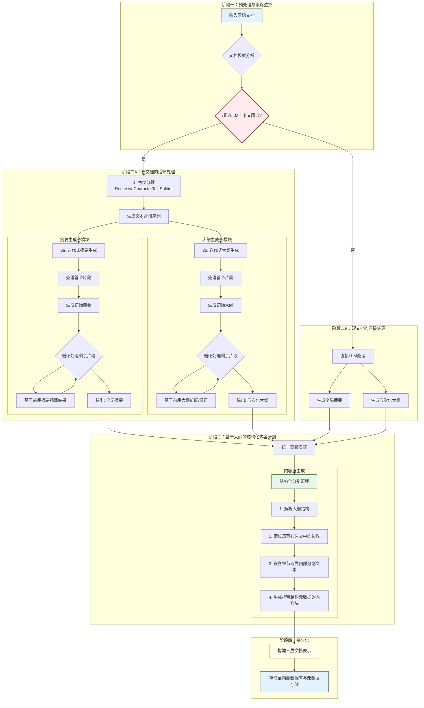

```mermaid
graph TD
    subgraph S1 ["阶段一：预处理与策略选择"]
        A["输入原始文档"] --> B{"文档长度分析"}
        B --> C{"超过LLM上下文窗口?"}
    end

    subgraph S2A ["阶段二A：长文档的递归处理"]
        C -->|"是"| D["1. 初步分段<br/>RecursiveCharacterTextSplitter"]
        D --> E["生成文本片段序列"]
        E --> F_SUM["2a. 迭代式摘要生成"]
        E --> F_OUT["2b. 迭代式大纲生成"]

        subgraph SUB1 ["摘要生成子模块"]
            F_SUM --> G_SUM["处理首个片段"]
            G_SUM --> H_SUM["生成初始摘要"]
            H_SUM --> I_SUM{"循环处理剩余片段"}
            I_SUM --> J_SUM["基于前序摘要精炼结果"]
            J_SUM --> I_SUM
            I_SUM --> K_SUM["输出: 全局摘要"]
        end

        subgraph SUB2 ["大纲生成子模块"]
            F_OUT --> G_OUT["处理首个片段"]
            G_OUT --> H_OUT["生成初始大纲"]
            H_OUT --> I_OUT{"循环处理剩余片段"}
            I_OUT --> J_OUT["基于前序大纲扩展/修正"]
            J_OUT --> I_OUT
            I_OUT --> K_OUT["输出: 层次化大纲"]
        end
    end

    subgraph S2B ["阶段二B：短文档的直接处理"]
        C -->|"否"| L["直接LLM处理"]
        L --> M_SUM["生成全局摘要"]
        L --> M_OUT["生成层次化大纲"]
    end

    subgraph S3 ["阶段三：基于大纲的结构化内容分割"]
        K_SUM --> N["统一高级表征"]
        K_OUT --> N
        M_SUM --> N
        M_OUT --> N

        N --> O["结构化分割流程"]
        subgraph SUB3 ["内容层生成"]
            O --> P["1. 解析大纲结构"]
            P --> Q["2. 定位章节在原文中的边界"]
            Q --> R["3. 在各章节边界内部分割文本"]
            R --> S["4. 生成携带结构元数据的内容块"]
        end
    end

    subgraph S4 ["阶段四：持久化"]
        S --> T["构建三层文档表示"]
        T --> U["存储至向量数据库与元数据存储"]
    end

    %% 样式定义
    style A fill:#e3f2fd,stroke:#333
    style U fill:#e3f2fd,stroke:#333
    style C fill:#ffebee,stroke:#c62828,stroke-width:2px
    style O fill:#e8f5e9,stroke:#2e7d32,stroke-width:2px
    style T fill:#fffde7,stroke:#f57f17
```